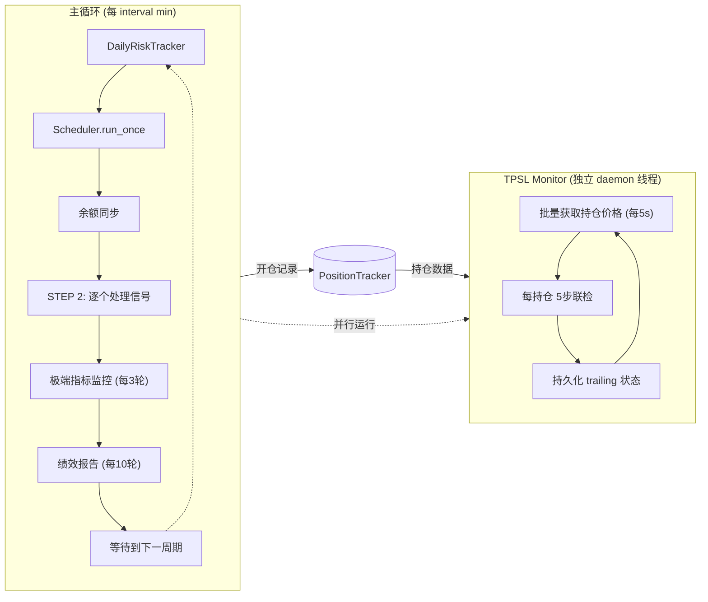
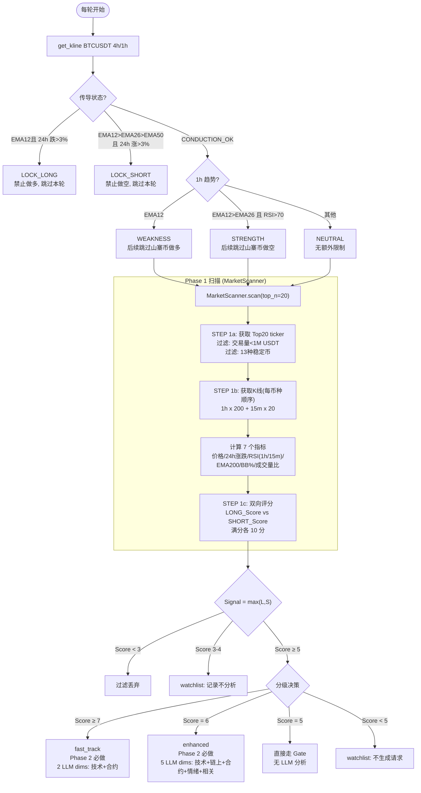
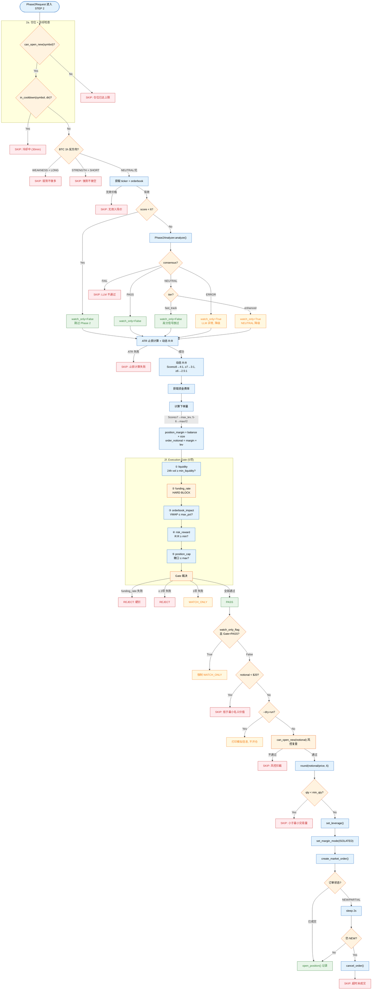
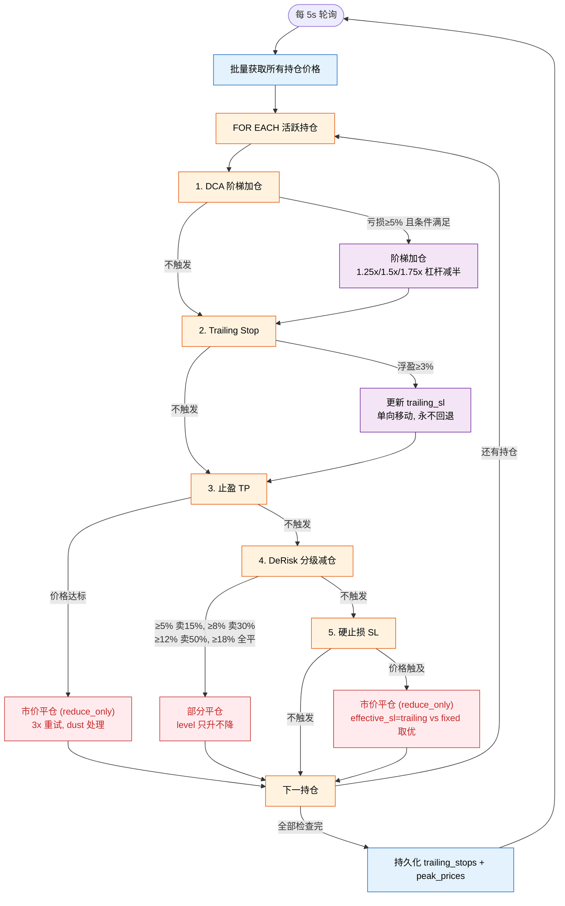
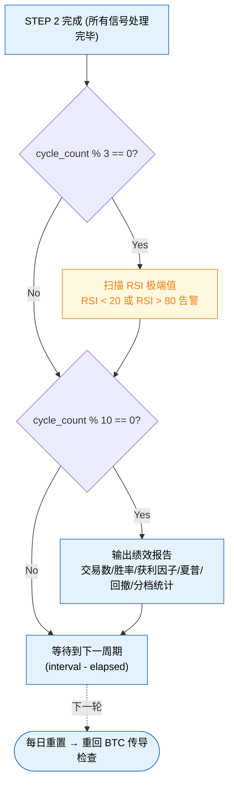

# 全流程自动扫描+自动交易 — 实施方案（更新版 2026-05-11）

## Context

当前**全部 7 个 User Story 已实现并部署**，覆盖实盘交易完整链路：

- `_real_exchange.py` — Binance 直连 HTTP（非 ccxt，HMAC-SHA256 签名，3 次指数退避重试）
- `market_scanner.py` — Phase 1 纯代码扫描（7 指标 + 双向 10 分制评分 + 趋势过滤清零）
- `position_tracker.py` — 持仓管理（RLock 保护 + JSON 持久化 + DCA/DeRisk 支持）
- `tpsl_monitor.py` — 止盈止损守护线程（DCA → Trailing Stop → TP → DeRisk → SL 5 步联检）
- `scheduler.py` — 调度引擎（BTC 传导 → Phase 1 → 分级决策 → Phase2Request）
- `execution_gate.py` — 5 项 Gate 校验（流动性、资金费率、盘口冲击、R:R、仓位上限）
- `btc_conduction.py` — BTC 4h 趋势联动锁定 + 1h 短期趋势检查
- `atr_stop.py` — Wilder 平滑 ATR(14) 动态止损计算
- `phase2.py` — Phase 2 LLM 分析，SkillsLoader + ChatLLM 8 维评分
- `config.py` — 完整配置体系（DeRisk + DCA + ATR + Gate + BTC + Funding）
- 40+ 个单元测试全部通过

### 部署架构 vs 原方案差异

| 维度 | 原方案 | 实际实现 |
|------|--------|---------|
| RealExchange | ccxt (`fetch_ohlcv`, `fetch_ticker` 等) | **直连 HTTP** (`requests.get` → `api.binance.com`)，避免 ccxt load_markets 开销 |
| 批量行情 | `ccxt.fetch_tickers()` | `/api/v3/ticker/24hr` 单次获取全部 USDT 交易对 |
| K线数据 | ccxt `fetch_ohlcv()` | `/api/v3/klines` 直连，futures 不可用时自动 fallback 到 spot |
| 签名方式 | ccxt 内置 | **HMAC-SHA256** 自实现，无第三方依赖 |
| 部署方式 | 未指定 | **`python run_live_trading.py`** 直接进程运行（非 Docker） |
| Phase 2 分析 | 8 个独立 Skill 文件 | **Phase2Analyzer** (SkillsLoader + ChatLLM, 8 dim→skill 映射, JSON verdict 输出) |
| Docker 权限 | `vibe` 非 root | `user: root` + `HOME=/home/vibe` |
| 持仓持久化 | 直接写入 | `_persist()` 加 `try/except PermissionError`，不可写时降级内存 |
| 稳定币过滤 | 无 | 14 种稳定币被过滤 |
| 合约可用性 | 无 | 仅返回 `_valid_symbols` 中的合约币种 |
| SSL 连接 | 裸 `requests.get()` | `requests.Session` + 连接池 (pool_maxsize=20) + urllib3 Retry |
| 过滤可见性 | 静默 | INFO 日志记录稳定币过滤；合约过滤 DEBUG 级别 |
| 持仓模式 | 双向持仓 | **单向持仓 (one-way)** — `set_position_mode(dual=False)` |
| 保证金模式 | 全仓 | **逐仓 (ISOLATED)** — 开仓前设置，已有持仓时回退全仓 |
| 风控 | 基础 TP/SL | **DCA 阶梯加仓 + DeRisk 分级减仓 + Trailing Stop + Doom + 日亏损熔断** |

## 完整交易流程图

### 系统架构总览



### SCHEDULER.run_once() 流程 — 纯代码，无 LLM



### Phase 1 — 7 个指标

| 指标 | 来源 | 用途 |
|------|------|------|
| 当前价格 | ticker | 基准价 |
| 24h 涨跌幅 | ticker | 短期动量 |
| RSI(14, 1h) | 1h K线计算 | 主周期超买超卖 |
| RSI(14, 15m) | 15m K线计算 | 跨周期确认 |
| 价格 vs EMA200 | 1h K线计算 | 大趋势方向 |
| 成交量比 | 1h K线计算 | 放量/缩量 = 量能异动 |
| BB% | 1h K线(20,2) | (price-low)/(up-low) 超买超卖验证 |

### Phase 1 — 双向评分 (满分 10 分)

| LONG 条件 | +分 | SHORT 条件 | +分 |
|-----------|-----|-----------|-----|
| RSI(1h) < 30 | +2 | RSI(1h) > 70 | +2 |
| RSI(1h) 30-40 | +1 | RSI(1h) 60-70 | +1 |
| RSI(15m) < 30 | +1 | RSI(15m) > 70 | +1 |
| RSI(15m) < RSI(1h) | +1 | RSI(15m) > RSI(1h) | +1 |
| 24h 跌 > 5% | +1 | 24h 涨 > 5% | +1 |
| 24h 跌 > 10% | +2 | 24h 涨 > 10% | +2 |
| BB% < 0.2 | +1 | BB% > 0.8 | +1 |
| 近8h 低位区 | +1 | 近8h 高位区 | +1 |
| price > EMA200 | +1 | price < EMA200 | +1 |
| 放量下跌 | +1 | 放量上涨 | +1 |
| K线看涨形态 | +1 | K线看跌形态 | +1 |

**趋势过滤清零**: LONG 时若 price < EMA200 且 RSI(1h) > 40 → score = 0（下降趋势中非超卖不做多）。SHORT 时若 price > EMA200 且 RSI(1h) < 60 → score = 0（上升趋势中非超买不做空）。

### STEP 2 — 自动交易链路 (每信号顺序处理)



### TPSL Monitor 守护进程 (独立 daemon 线程)



### 主循环末尾 (每轮)



### 核心模块调用清单

| 阶段 | 函数/模块 | 类型 | 状态 |
|------|----------|------|------|
| BTC 联动 | `btc_conduction.check_btc_conduction()` | 代码 | ✅ |
| BTC 1h 趋势 | `btc_conduction.check_btc_1h_trend()` | 代码 | ✅ |
| 行情获取 | `RealExchange.get_tickers/get_kline/get_funding_rate/get_orderbook` | 代码 | ✅ 直连 HTTP |
| Phase 1 扫描 | `MarketScanner.scan()` (纯 Python, 7 指标+评分+排名, <1s) | 代码 | ✅ |
| 分级决策 | `TradingScheduler.run_once()` → `ScheduleReport` + `Phase2Request` | 代码 | ✅ |
| Dim 1 技术面 | `Phase2Analyzer` → `SkillsLoader.get_content("technical-basic")` + `get_content("candlestick")` | LLM | ✅ |
| Dim 2 链上 | `get_content("onchain-analysis")` | LLM | ✅ |
| Dim 3 合约 | `get_content("perp-funding-basis")` + `get_content("liquidation-heatmap")` | LLM | ✅ |
| Dim 4 情绪 | `get_content("sentiment-analysis")` + `get_content("social-media-intelligence")` | LLM | ✅ |
| Dim 5 波动率 | `get_content("volatility")` | LLM | ✅ |
| Dim 6 稳定币 | `get_content("stablecoin-flow")` + `get_content("market-microstructure")` | LLM | ✅ |
| Dim 7 风险 | `get_content("risk-analysis")` | LLM | ✅ |
| Dim 8 相关性 | `get_content("correlation-analysis")` + `get_content("sector-rotation")` | LLM | ✅ |
| ATR 止损 | `atr_stop.calculate_atr_stop()` | 代码 | ✅ |
| Execution Gate | `execution_gate.ExecGateEngine.run_gate()` | 代码 | ✅ |
| 仓位检查 | `position_tracker.PositionTracker.can_open_new()` | 代码 | ✅ |
| 下单 | `RealExchange.create_market_order()` | 代码 | ✅ 直连 HTTP |
| DCA 阶梯加仓 | `TPSLMonitor._check_dca()` + `PositionTracker.adjust_position()` | 代码 | ✅ |
| DeRisk 分级减仓 | `TPSLMonitor._check_de_risk()` + `PositionTracker.de_risk_partial_exit()` | 代码 | ✅ |
| TP/SL 监控 | `tpsl_monitor.TPSLMonitor` (Thread, 5s 轮询, 批量 ticker) | 代码 | ✅ |
| 日亏损熔断 | `DailyRiskTracker` (内联在 run_live_trading.py) | 代码 | ✅ |
| 主循环集成 | `run_live_trading.py` 主循环 → Phase2Analyzer → ATR → Gate → 下单 | 代码 | ✅ |
| 部署 | `python extensions/run_live_trading.py --balance 50 --interval 15` | 部署 | ✅ 运行中 |

## 配置体系 (config.py)

### FundingRateConfig — 资金费率过滤

```python
@dataclass
class FundingRateConfig:
    max_long_funding: float = 0.0010   # > 0.10% → 禁止追多
    min_short_funding: float = -0.0005 # < -0.05% → 禁止追空
```

Execution Gate 硬性检查项，不通过直接 REJECT。

### DeRiskConfig — 分级减仓配置

```python
@dataclass
class DeRiskConfig:
    level1_loss_pct: float = 5.0      # 亏损 ≥ 5% → 卖出 15%
    level1_sell_fraction: float = 0.15
    level2_loss_pct: float = 8.0      # 亏损 ≥ 8% → 卖出 30%
    level2_sell_fraction: float = 0.30
    level3_loss_pct: float = 12.0     # 亏损 ≥ 12% → 卖出 50%
    level3_sell_fraction: float = 0.50
    doom_loss_pct: float = 18.0       # 亏损 ≥ 18% → 全平
```

所有亏损阈值参照 `first_entry_cost`（首次入场成本），DCA 加仓不改变此参照系。

### ATRStopConfig — 动态止损

```python
@dataclass
class ATRStopConfig:
    multiplier_default: float = 2.0        # 2.0 × ATR(14)
    multiplier_conservative: float = 1.5   # 保守 1.5 × ATR(14)
    period: int = 14
    min_stop_distance_pct: float = 8.0     # 最小止损距离，保 DCA 空间
```

### ExecutionGateConfig — 开仓校验

```python
@dataclass
class ExecutionGateConfig:
    min_liquidity_usdt: float = 1_000_000
    max_orderbook_impact_pct: float = 0.5
    min_risk_reward_ratio: float = 1.0
    max_position_pct: float = 20.0         # 单笔保证金占用上限
    signal_cooldown_minutes: int = 30
```

### DCAConfig — 阶梯加仓配置

```python
@dataclass
class DCAConfig:
    enabled: bool = True
    max_dca_count: int = 3                  # 最多 3 次加仓
    trigger_loss_pct: float = 5.0           # 亏损 ≥ 5% 触发
    dca_multipliers: tuple = (1.25, 1.5, 1.75)  # 阶梯乘数
    dca_leverage_halved: bool = True        # 减半杠杆
    max_account_loss_pct: float = 8.0       # 该仓位累计亏损上限
    dca_min_notional_usdt: float = 20.0     # Binance 最小名义价值
```

### BTCConductionConfig

```python
@dataclass
class BTCConductionConfig:
    ema_periods_short: int = 12
    ema_periods_mid: int = 26
    ema_periods_long: int = 50
    price_change_threshold_pct: float = 3.0
    lookback_hours: int = 4
```

### LiveTradingConfig — 综合配置

含 3 种预设：`default`、`conservative`（流动性 200 万、R:R 1.5、仓位 2%）、`aggressive`（流动性 50 万、R:R 0.8、仓位 10%）。

## 持仓数据结构 (position_tracker.py)

### Position — 单个活跃持仓

```python
@dataclass
class Position:
    symbol: str
    direction: str              # "LONG" / "SHORT"
    entry_price: float          # 平均入场价（DCA 后更新）
    quantity: float             # 总数量
    stop_loss: float            # 止损价
    take_profit: Optional[float] = None
    opened_at: str = ""         # ISO 8601
    dca_count: int = 0          # DCA 加仓计数
    leverage: int = 1
    entry_score: int = 0        # 开仓时评分
    first_entry_cost: float = 0.0    # 首次入场价（不变参照系）
    first_entry_quantity: float = 0.0  # 首次数量（不变参照系）
    de_risk_level: int = 0      # 已触发最高 de-risk 级别 (0-4)
```

### CloseRecord — 已平仓记录

```python
@dataclass
class CloseRecord:
    symbol, direction, entry_price, exit_price, quantity
    pnl_usdt, pnl_pct: float
    reason: str                 # "TP" | "SL" | "MANUAL" | "DOOM" | "DE_RISK_X"
    dca_count: int
    leverage: int
    entry_score: int
```

### PositionTracker 核心方法

| 方法 | 用途 | 线程安全 |
|------|------|---------|
| `open_position()` | 开仓记录, 启动冷却 | ✅ RLock |
| `close_position()` | 平仓 + PnL 计算 + 历史记录 | ✅ |
| `adjust_position()` | DCA 加仓 (recalc avg entry_price) | ✅ |
| `reduce_position()` | 部分平仓 (partial fill) | ✅ |
| `de_risk_partial_exit()` | DeRisk 分级减仓 (level 只升不降) | ✅ |
| `can_open_new()` | 仓位上限 + 暴露率检查 | ✅ |
| `is_in_cooldown()` | 30min 信号冷却 | ✅ |
| `get_win_rate_by_score_tier()` | 按 Score 分档统计胜率 | ✅ |
| `get_performance_metrics()` | 完整绩效指标 (夏普/回撤/获利因子) | ✅ |
| `get_trailing_state()` / `set_trailing_state()` | Trailing stop 持久化 | ✅ |

JSON 持久化到 `~/.vibe-trading/positions.json`，权限不足时降级内存运行。

## 止盈止损守护 (tpsl_monitor.py)

### 架构

- `TPSLMonitor` 继承 `Thread`，daemon 线程
- 默认每 5 秒轮询，批量获取所有持仓当前价（单次 API 调用）
- 纯代码逻辑，无 LLM，低延迟

### 5 步联检 (每持仓每轮)

```
1. DCA 检查       ← 亏损 ≥ 5% → 阶梯加仓 (1.25×/1.5×/1.75×)
2. Trailing Stop  ← 浮盈 ≥ 3% → 追踪锁定利润 (1.5% 距离)
3. 止盈 TP        ← 价格达标 → 市价平仓 (时间衰减或无固定 TP)
4. DeRisk 减仓    ← 亏损扩大 → 分级减仓 (15%/30%/50%)
5. 硬止损 SL      ← 价格触及 → 市价平仓 (最后防线)
```

### 执行保障

- **所有平仓使用 market order + reduce_only=True**
- **3 次重试** (指数退避 1s/2s/4s)
- **Dust 处理**：剩余量 < 最小交易单位时 tracker 内关闭
- **事件回调**：`on_take_profit` / `on_stop_loss` / `on_error`
- **Trailing stop 持久化**：重启恢复 trailing_stops + peak_prices

### 时间衰减止盈 (no-fixed-TP 场景)

| 持仓时间 | TP 阈值 |
|----------|---------|
| < 30 min | +5% |
| 30-60 min | +3% |
| 60-120 min | +1% |
| > 120 min | +0.1% (保本附近) |

固定 `take_profit` 优先使用。

### DeRisk 执行细节

- 参照 `first_entry_cost`，DCA 加仓后不漂移
- Level 只升不降，防止重复触发
- Level 4(Doom) = 全平，不走 partial_exit
- 空仓时自动改 full close
- Binance $20 最小名义价值跳过

### DCA 执行细节

- 亏损参照 `first_entry_cost`，与 DeRisk 一致
- 暴露率检查：加仓后总敞口 ≤ max_exposure_pct
- 账户级保护：该仓位累计亏损 ≤ max_account_loss_pct
- 杠杆减半：`max_leverage // 2`

## 主循环完整流程 (run_live_trading.py)

```
每 15 min (--interval 可配):
  ├─ DailyRiskTracker.reset_if_new_day()         # 跨日重置
  ├─ DailyRiskTracker.is_blown?                  # -10%/日 → 熔断 4h
  │   熔断 → 空报告，跳过本轮
  │   未熔断 → Scheduler.run_once()
  │     ├─ BTC conduction + 1h trend
  │     ├─ Phase 1 scan
  │     └─ 分级决策 → Phase2Requests
  │
  ├─ 余额同步 (RealExchange.get_account_balance)
  │
  ├─ FOR each Phase2Request:
  │   ├─ can_open_new + is_in_cooldown
  │   ├─ BTC 1h 反方向过滤
  │   ├─ Phase 2 LLM (score≥6 才调用)
  │   │   PASS→继续 / FAIL→跳过 / NEUTRAL→fast_track放过,enhanced降级
  │   ├─ ATR stop + 动态 R:R (Score≥8→4:1, ≥7→3:1, ≥6→2.5:1)
  │   ├─ 动态杠杆 (Score≥7→max, 5-6→max//2)
  │   ├─ Execution Gate (5 项)
  │   └─ PASS → set_leverage + set_margin + market_order
  │
  ├─ 极端指标监控 (每 3 轮): RSI<20 或 RSI>80 告警
  └─ 绩效报告 (每 10 轮): 交易数/胜率/获利因子/夏普/回撤/分档统计
```

### 执行模式

| CLI 标志 | 效果 |
|----------|------|
| `--mock` | 使用 MockExchange 模拟 |
| `--dry-run` | 扫描评估但不执行订单 |
| `--no-phase2` | 跳过 LLM 分析，仅 Phase 1 + Gate |

## 文件变更清单

| 文件 | 状态 | 说明 |
|------|------|------|
| `extensions/live_trading/engine/_real_exchange.py` | ✅ | Binance 直连 HTTP (HMAC-SHA256, urllib3 Retry, pool_maxsize=20) |
| `extensions/live_trading/engine/market_scanner.py` | ✅ | Phase 1 纯代码扫描 (7 指标+10分制+稳定币过滤) |
| `extensions/live_trading/engine/position_tracker.py` | ✅ | 持仓管理 (RLock + DCA/DeRisk 支持 + trailing 持久化) |
| `extensions/live_trading/engine/tpsl_monitor.py` | ✅ | TP/SL 守护 (DCA+Trailing+TP+DeRisk+SL 5步联检) |
| `extensions/live_trading/engine/scheduler.py` | ✅ | 扫描调度引擎 (BTC → Phase 1 → 分级决策) |
| `extensions/live_trading/engine/atr_stop.py` | ✅ | Wilder ATR(14) 动态止损 |
| `extensions/live_trading/engine/execution_gate.py` | ✅ | 5 项 Gate 校验 (含盘口冲击模拟) |
| `extensions/live_trading/engine/phase2.py` | ✅ | Phase 2 LLM 分析 (SkillsLoader + ChatLLM) |
| `extensions/live_trading/engine/btc_conduction.py` | ✅ | BTC 4h 联动 + 1h 趋势检查 |
| `extensions/live_trading/__init__.py` | ✅ | 包导出 |
| `extensions/live_trading/models.py` | ✅ | 核心数据模型 |
| `extensions/live_trading/config.py` | ✅ | 完整配置 (DeRisk + DCA + ATR + Gate + BTC + Funding) |
| `extensions/tools/live_trading_tool.py` | ✅ | 8 actions (Agent 工具集成) |
| `extensions/run_live_trading.py` | ✅ | 实盘入口脚本 (含 DailyRiskTracker) |
| `extensions/tests/test_live_trading_e2e.py` | ✅ | 端到端集成测试 |
| `extensions/tests/test_market_scanner.py` | ✅ | 评分规则单元测试 (12+) |
| `extensions/tests/test_execution_gate.py` | ✅ | Gate 校验测试 |
| `extensions/tests/test_position_tracker.py` | ✅ | 持仓管理测试 |
| `extensions/tests/test_tpsl_monitor.py` | ✅ | TP/SL 测试 |
| `extensions/tests/test_scheduler.py` | ✅ | 调度器测试 |
| `extensions/tests/test_real_exchange.py` | ✅ | RealExchange 直连测试 |

## 验证计划 — 当前状态

1. ✅ **MarketScanner 评分测试**: 12+ 独立单元测试全部通过
2. ✅ **单元测试**: 40+ 用例，MockExchange 驱动
3. ✅ **集成测试**: `test_live_trading_e2e.py` 覆盖全链路
4. ✅ **Lint**: `ruff check` 通过
5. ✅ **部署**: 164 服务器运行中，账户 $50 → $84.58 (+69%)
6. ✅ **实盘验证**: RealExchange 直连 Binance 主网，开单成功
7. ✅ **单向持仓 + 逐仓模式**: 启动设 one-way，开仓前设 ISOLATED
8. ✅ **DCA/DeRisk 联检**: TPSLMonitor 5 步联检正常运行
9. ✅ **持久的 trailing stop**: 穿越重启恢复
10. ✅ **日亏损熔断**: -10%/日自动暂停 4h
11. ✅ **Docker 降级**: 不可写时仅内存运行
12. ✅ **稳定币过滤**: 14 种稳定币排除
13. ✅ **SSL 优化**: 连接池 + urllib3 Retry
14. ✅ **绩效报告**: 每 10 轮含 Score 分档胜率

## 待办事项

### Phase 3 — Score 感知动态参数 (待评估)

当前系统已存储 `entry_score` 并做分档统计，但尚未基于 Score 动态调整以下参数：

| 参数 | 当前 (统一) | 建议计划 |
|------|------------|---------|
| 仓位大小 `position_size_pct` | 0.05 (5%) | Score≥8→10%, 5-6→3% |
| ATR 止损乘数 | 2.0x (统一) | Score≥8→1.5x, 5-6→2.5x |
| DCA 触发阈值 | 5% | Score≥8→8%, 5-6→5% |
| 冷却时间 | 30 min | Score≥8→15min, 5-6→60min |

**前置条件**: 积累 50+ 笔交易，通过 `get_win_rate_by_score_tier()` 验证高分信号确实优于低分。

### 改进项

- Phase 2 LLM 多维度评估结果与 Gate 结果联动（当前仅做 NEUTRAL→WATCH_ONLY 降级）
- Trailing stop 参数自适应（波动率高时放大 trail_distance）
- 多币种相关性风险（同一板块多个持仓的聚合敞口）
- 交易所故障转移（Binance 不可用时自动切换）
