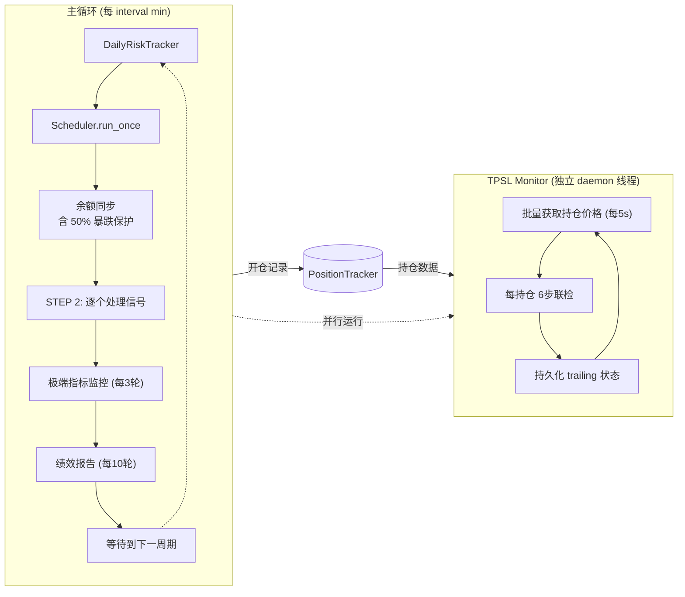
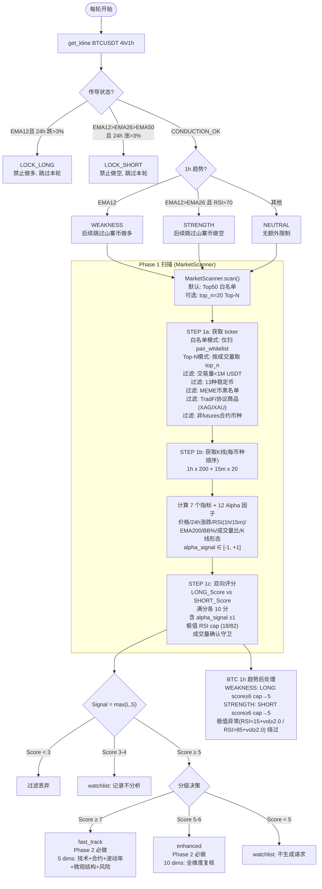
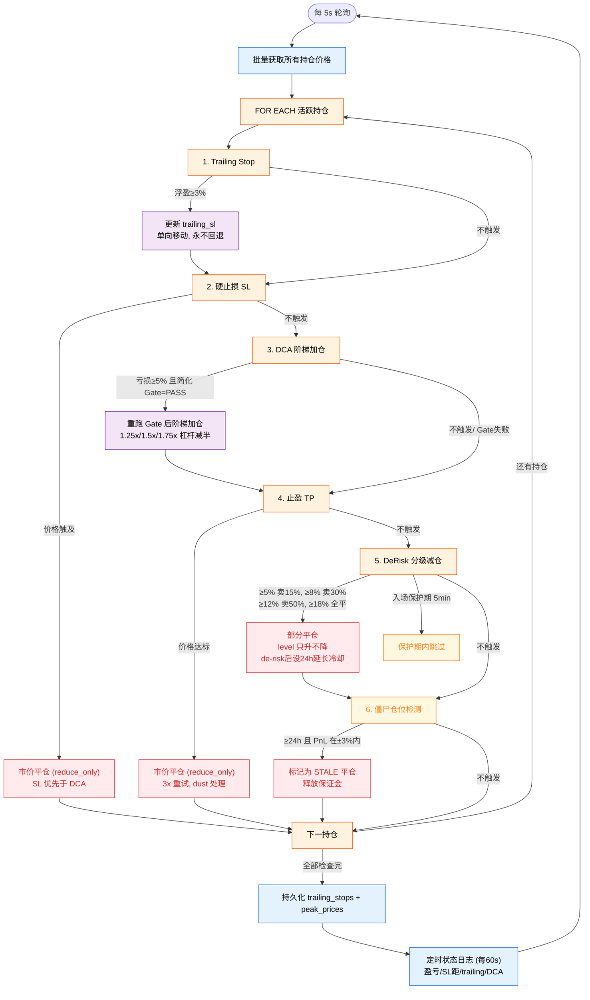
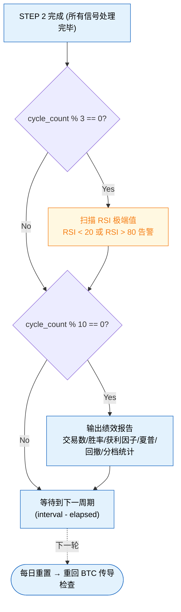

# 全流程自动扫描+自动交易 — 实施方案（更新版 2026-05-21）

## Context

当前自动交易链路已实现，覆盖实盘前的扫描、复核、Gate、开仓、持仓管理和退出风控：

- `_real_exchange.py` — Binance 直连 HTTP（默认 futures，HMAC-SHA256 签名，3 次指数退避重试）
- `market_scanner.py` — Phase 1 纯代码扫描（7 指标 + 12 Alpha 因子 + 双向 10 分制评分 + 趋势过滤清零 + 极值风控）
- `alpha_factors.py` — 12 个精选横截面 Alpha 因子（动量/反转/波动率/量价），加权聚合为 alpha_signal ∈ [-1, +1]
- `position_tracker.py` — 持仓管理（RLock 保护 + **SQLite WAL** `trading.db` 持久化 + mark/equity exposure + DCA/DeRisk 已实现盈亏记录 + 分档胜率统计）
- `tpsl_monitor.py` — 止盈止损守护线程（Trailing Stop → SL → DCA Gate → TP → DeRisk → STALE 6 步联检）
- `scheduler.py` — 调度引擎（BTC 传导 → Phase 1 → 分级决策 → Phase2Request，含闲置扫描告警）
- `execution_gate.py` — 5 项 Gate 校验（流动性、资金费率、盘口冲击、R:R、仓位上限；白名单模式下额外 **whitelist** 硬拒绝）+ 硬失败直接 REJECT
- `btc_conduction.py` — BTC 4h 趋势联动锁定 + 1h 短期趋势检查
- `atr_stop.py` — Wilder 平滑 ATR(14) 动态止损计算
- `phase2.py` — Phase 2 LLM 分析，SkillsLoader + ChatLLM **10 维**评分（含 dim9 宏观/ETF + dim10 行为/监管）
- `config.py` — 完整配置体系（DeRisk + DCA + ATR + Gate + BTC + Funding + 模式预设）
- `run_live_trading.py` — 主入口（默认 **Top50 白名单** `with_top50_whitelist()` + 日亏损熔断 + 余额同步+暴跌保护 + 50% crash guard + 可用余额开仓上限）
- `whitelist.py` + `whitelist.json` — Top50 币种三档白名单（Agent/Scanner/Gate 三层强制）
- 扩展测试覆盖 Gate、ATR、Scheduler、Phase2、PositionTracker、TPSLMonitor、RealExchange 与入口安全

### 部署架构 vs 原方案差异


| 维度           | 原方案                                    | 实际实现                                                                                                                 |
| ------------ | -------------------------------------- | -------------------------------------------------------------------------------------------------------------------- |
| RealExchange | ccxt (`fetch_ohlcv`, `fetch_ticker` 等) | **直连 HTTP** (`requests.get` → `api.binance.com`)，避免 ccxt load_markets 开销                                             |
| 批量行情         | `ccxt.fetch_tickers()`                 | futures 默认 `/fapi/v1/ticker/24hr`，spot 模式 `/api/v3/ticker/24hr`                                                      |
| K线数据         | ccxt `fetch_ohlcv()`                   | `/api/v3/klines` 直连，futures 不可用时自动 fallback 到 spot                                                                   |
| 签名方式         | ccxt 内置                                | **HMAC-SHA256** 自实现，无第三方依赖                                                                                           |
| 部署方式         | 未指定                                    | **本地/服务器**: `python extensions/run_live_trading.py`；**Docker**: `docker compose up -d live-trading`（`compose` 挂载数据卷） |
| Phase 1 标的池  | Top-N 成交量扫描                            | **默认 Top50 白名单**（`with_top50_whitelist()`，`scan_top_n=0`）；`--pairs` 或 `scan_top_n=20` 可切回 Top-N                      |
| Phase 2 分析   | 8 个独立 Skill 文件                         | **Phase2Analyzer** (SkillsLoader + ChatLLM, **10** dim→skill 映射, JSON verdict 输出)                                    |
| Alpha 因子     | 无                                      | 12 个公式化因子 → `alpha_signal` 贡献 ±1 分给 LONG/SHORT 评分                                                                    |
| Docker 权限    | `vibe` 非 root                          | `user: root` + `HOME=/home/vibe`                                                                                     |
| 持仓持久化        | JSON 单文件                               | **SQLite** `~/.vibe-trading/trading.db`（WAL）；启动时从旧 `positions.json` 自动迁移；不可写时降级内存                                    |
| 稳定币过滤        | 无                                      | 13 种稳定币被过滤                                                                                                           |
| MEME 币黑名单    | 无                                      | BIO/BILL/LAB 等极端风险币种被过滤（`_MEMECOIN_BLACKLIST`）                                                                       |
| TradFi 协议商品  | 无                                      | XAG(白银)/XAU(黄金) 需签署 Binance TradFi-Perps 协议，自动跳过                                                                     |
| 合约可用性        | 无                                      | `BINANCE_MARKET_TYPE` 默认 `future`，仅返回 `_valid_symbols` 中的合约币种                                                        |
| SSL 连接       | 裸 `requests.get()`                     | `requests.Session` + 连接池 (pool_maxsize=20) + urllib3 Retry                                                           |
| 过滤可见性        | 静默                                     | INFO 日志记录稳定币过滤；合约过滤 DEBUG 级别                                                                                         |
| 持仓模式         | 双向持仓                                   | **单向持仓 (one-way)** — `set_position_mode(dual=False)`                                                                 |
| 保证金模式        | 全仓                                     | **逐仓 (ISOLATED)** — 开仓前设置，已有持仓时回退全仓                                                                                  |
| 风控           | 基础 TP/SL                               | **SL 优先 + DCA 前重跑 Gate + DeRisk 实现盈亏记录 + Trailing Stop + Doom + 日亏损熔断 + 入场保护期**                                      |
| 余额同步         | 无                                      | 每轮同步实际余额，**50% 暴跌保护**、可用余额开仓上限                                                                                       |
| 闲置告警         | 无                                      | 连续 12 次无开仓+无持仓 → IDLE ALERT 日志告警                                                                                     |
| DeRisk 入场保护  | 无                                      | `entry_grace_minutes=5.0` 新开仓保护期内不触发 DE-RISK                                                                         |


## 完整交易流程图

### 系统架构总览


```mermaid
flowchart LR
    subgraph MAIN["主循环 (每 interval min)"]
        direction TB
        DR[DailyRiskTracker] --> RUN_ONCE[Scheduler.run_once]
        RUN_ONCE --> BAL[余额同步<br>含 50% 暴跌保护]
        BAL --> STEP2[STEP 2: 逐个处理信号]
        STEP2 --> EXTREME["极端指标监控 (每3轮)"]
        EXTREME --> REPORT["绩效报告 (每10轮)"]
        REPORT --> WAIT["等待到下一周期"] -.-> DR
    end

    subgraph DAEMON["TPSL Monitor (独立 daemon 线程)"]
        direction TB
        POLL["批量获取持仓价格 (每5s)"] --> CHECK["每持仓 6步联检"]
        CHECK --> PERSIST["持久化 trailing 状态"]
        PERSIST --> POLL
    end

    MAIN -->|开仓记录| PT[(PositionTracker)]
    PT -->|持仓数据| DAEMON
    MAIN -.->|并行运行| DAEMON
```


### SCHEDULER.run_once() 流程 — 纯代码，无 LLM


```mermaid
flowchart TD
    START(["每轮开始"]) --> BTC[get_kline BTCUSDT 4h/1h]
    BTC --> COND{传导状态?}

    COND -->|EMA12<EMA26<EMA50<br>且 24h 跌>3%| LOCK_LONG[LOCK_LONG<br>禁止做多, 跳过本轮]
    COND -->|EMA12>EMA26>EMA50<br>且 24h 涨>3%| LOCK_SHORT[LOCK_SHORT<br>禁止做空, 跳过本轮]
    COND -->|CONDUCTION_OK| TREND{1h 趋势?}

    TREND -->|EMA12<EMA26| WEAK[WEAKNESS<br>后续跳过山寨币做多]
    TREND -->|EMA12>EMA26 且 RSI>70| STRONG[STRENGTH<br>后续跳过山寨币做空]
    TREND -->|其他| NEUTRAL[NEUTRAL<br>无额外限制]

    WEAK --> SCAN
    STRONG --> SCAN
    NEUTRAL --> SCAN

    subgraph PHASE1["Phase 1 扫描 (MarketScanner)"]
        SCAN["MarketScanner.scan()<br>默认: Top50 白名单<br>可选: top_n=20 Top-N"] --> TICKER["STEP 1a: 获取 ticker<br>白名单模式: 仅扫 pair_whitelist<br>Top-N模式: 按成交量取 top_n<br>过滤: 交易量<1M USDT<br>过滤: 13种稳定币<br>过滤: MEME币黑名单<br>过滤: TradFi协议商品(XAG/XAU)<br>过滤: 非futures合约币种"]
        TICKER --> KLINE["STEP 1b: 获取K线(每币种顺序)<br>1h x 200 + 15m x 20"]
        KLINE --> INDICATORS["计算 7 个指标 + 12 Alpha 因子<br>价格/24h涨跌/RSI(1h/15m)/<br>EMA200/BB%/成交量比/K线形态<br>alpha_signal ∈ [-1, +1]"]
        INDICATORS --> SCORE["STEP 1c: 双向评分<br>LONG_Score vs SHORT_Score<br>满分各 10 分<br>含 alpha_signal ±1<br>极值 RSI cap (18/82)<br>成交量确认守卫"]
    end

    SCORE --> RANK{"Signal = max(L,S)"}
    RANK -->|Score < 3| FILTER[过滤丢弃]
    RANK -->|Score 3-4| WATCH[watchlist: 记录不分析]
    RANK -->|Score ≥ 5| TIER{分级决策}

    TIER -->|Score ≥ 7| FAST[fast_track<br>Phase 2 必做<br>5 dims: 技术+合约+波动率+微观结构+风险]
    TIER -->|Score 5-6| ENHANCED[enhanced<br>Phase 2 必做<br>10 dims: 全维度复核]
    TIER -->|Score < 5| END[watchlist: 不生成请求]

    SCORE --> BTC_CAP["BTC 1h 趋势后处理<br>WEAKNESS: LONG score≥6 cap→5<br>STRENGTH: SHORT score≥6 cap→5<br>极值异常(RSI<15+vol≥2.0 / RSI>85+vol≥2.0) 绕过"]
```


### Phase 1 扫描模式


| 模式                | 配置                                         | 行为                                                                               |
| ----------------- | ------------------------------------------ | -------------------------------------------------------------------------------- |
| **Top50 白名单（默认）** | `LiveTradingConfig.with_top50_whitelist()` | `pair_whitelist` 来自 `whitelist.json`（回退 `TOP_50`），`scan_top_n=0`，只扫描白名单内且市场存在的合约 |
| Top-N 成交量         | `scan_top_n=20`，`pair_whitelist=[]`        | 按 24h 成交量取前 N，再过滤稳定币/MEME/TradFi 等                                               |
| CLI 覆盖            | `--pairs BTC ETH SOL`                      | 覆盖 `pair_whitelist`，仍走同一套评分与 Gate                                                |


`run_live_trading.py` 启动时默认调用 `with_top50_whitelist()`；未传 `--pairs` 时使用 Top50，传 `--pairs` 或设置 `TRADING_PAIRS` 环境变量则覆盖白名单。

分级输出：`rankings` 包含所有 **score≥5** 的标的（无 Top3 截断）；`watchlist` 为 score 3–4。

### Phase 1 — 7 个指标 + 12 Alpha 因子


| 指标           | 来源          | 用途                                 |
| ------------ | ----------- | ---------------------------------- |
| 当前价格         | ticker      | 基准价、price_tier 判定                  |
| 24h 涨跌幅      | ticker      | 短期动量                               |
| RSI(14, 1h)  | 1h K线计算     | 主周期超买超卖                            |
| RSI(14, 15m) | 15m K线计算    | 跨周期确认                              |
| 价格 vs EMA200 | 1h K线计算     | 大趋势方向                              |
| 成交量比         | 1h K线计算     | 放量/缩量 = 量能异动                       |
| BB%          | 1h K线(20,2) | (price-low)/(up-low) 超买超卖验证        |
| K线形态         | 1h O/H/L/C  | 11 种形态聚合（锤子/吞没/晨星等）→ {-1,0,+1}     |
| Alpha 因子 Zoo | 1h K线       | 12 因子加权聚合 → alpha_signal ∈ [-1,+1] |


### Alpha Factor Zoo (alpha_factors.py)

从 WorldQuant Alpha101、GTJA191、Qlib158 精选 12 个公式化因子，纯函数设计：


| 因子               | 类别  | 权重  | 说明                   |
| ---------------- | --- | --- | -------------------- |
| momentum_5       | 动量  | 1.5 | 5周期收益/波动率 z-score    |
| momentum_20      | 动量  | 1.0 | 20周期收益/波动率 z-score   |
| ts_rank_close_20 | 动量  | 1.0 | 收盘价在20周期窗口的位置 [0,1]  |
| ts_rank_hl_10    | 动量  | 1.0 | 收盘价在10周期高低区间的位置      |
| zscore_20        | 反转  | 1.2 | 价格距均线的 z-score（反转信号） |
| corr_pv_20       | 量价  | 1.0 | 价格-成交量 Pearson 相关系数  |
| ts_argmax_10     | 动量  | 0.8 | 最高价在窗口中的新鲜度 [0,1]    |
| ts_argmin_10     | 动量  | 0.8 | 最低价在窗口中的新鲜度 [0,1]    |
| vol_regime_20    | 波动率 | 0.6 | ATR 扩张(>0)/收缩(<0)    |
| norm_range_14    | 波动率 | 0.5 | 归一化振幅相对中位数的偏离        |
| vpt_14           | 量价  | 1.0 | 量价趋势方向确认             |
| run_streak_8     | 动量  | 0.7 | 连续阳/阴线计数             |


加权聚合为 `alpha_signal ∈ [-1, +1]`，在 LONG/SHORT 评分中贡献 ±1 分。

> `compute_all()` 另计算 `ts_rank_volume_20` 供调试/扩展，**未**纳入 `_FACTOR_REGISTRY` 加权，不参与 `alpha_signal`。

### Phase 1 — 双向评分 (满分 10 分)

#### LONG 评分


| 条件                             | 分值    | 说明            |
| ------------------------------ | ----- | ------------- |
| RSI(1h) < 30                   | +2    | 技术超卖          |
| RSI(1h) 30-40                  | +1    | 接近超卖          |
| RSI(15m) < 30                  | +1    | 短线超卖          |
| RSI(15m) < RSI(1h)             | +1    | 短线弱于长线，下行确认   |
| 24h 跌 > 5%                     | +1    | 价格下跌          |
| 24h 跌 > 10%                    | +2    | 深度下跌          |
| BB% < 0.2                      | +1    | 价格在布林下轨附近     |
| 8h 低位区 (price_in_8h_pct < 0.2) | +1    | 短期低位          |
| price > EMA200                 | +1    | 价格在均线上方       |
| 放量下跌 (vol_ratio>1.5 且 24h<0)   | +1    | 量能确认          |
| K线看涨形态 (candlestick>0)         | +1    | 形态确认          |
| alpha_signal > 0.4             | +1    | Alpha 因子强多头对齐 |
| alpha_signal < -0.3            | -1    | Alpha 因子空头背离  |
| 低价惩罚 (<$1)                     | -1    | 流动性差，暴跌风险大    |
| RSI<30 + 24h跌>15%              | cap=5 | 极端下跌接飞刀保护     |
| RSI < 18（且 vol<2.0）            | cap=5 | 深度单边下跌，非反转信号  |
| score≥6 但 vol_ratio<1.5        | cap=5 | 高分信号需成交量确认    |


**趋势过滤清零**: price < EMA200 且 RSI(1h) > 40 → score = 0（下降趋势中非超卖不做多）。

#### SHORT 评分


| 条件                               | 分值    | 说明            |
| -------------------------------- | ----- | ------------- |
| RSI(1h) > 70                     | +2    | 技术超买          |
| RSI(1h) 60-70                    | +1    | 接近超买          |
| RSI(15m) > 70                    | +1    | 短线超买          |
| RSI(15m) > RSI(1h)               | +1    | 短线强于长线，上行确认   |
| 24h 涨 > 5%                       | +1    | 价格上涨          |
| 24h 涨 > 10%                      | +2    | 深度上涨          |
| BB% > 0.8                        | +1    | 价格在布林上轨附近     |
| 8h 高位区 (price_in_8h_pct > 0.8)   | +1    | 短期高位          |
| price < EMA200                   | +1    | 下降趋势中做空加分     |
| 放量上涨 (vol_ratio>1.5 且 24h>0)     | +1    | 量能确认          |
| K线看跌形态 (candlestick<0)           | +1    | 形态确认          |
| alpha_signal < -0.4              | +1    | Alpha 因子强空头对齐 |
| alpha_signal > 0.3               | -1    | Alpha 因子多头背离  |
| 下降趋势加分 (price < EMA200)          | +1    | 顺势做空          |
| 上升趋势 + 正动量 (price>EMA200, 24h>0) | -2    | 强做空惩罚         |
| 低价惩罚 (<$1)                       | -1    | 流动性差，做空风险大    |
| RSI>70 + 24h涨>15%                | cap=5 | 极度超买追逐保护      |
| RSI > 82（且 vol<2.0）              | cap=5 | 深度单边上涨，非反转信号  |
| score≥6 但 vol_ratio<1.5          | cap=5 | 高分信号需成交量确认    |


**趋势过滤清零**: price > EMA200 且 RSI(1h) < 60 → score = 0（上升趋势中非超买不做空）。

**price_tier 仓位系数**: micro(<$0.1)=50%, low(<$1)=75%, standard/premium=100%（执行层据此缩减低价币仓位）。

#### BTC 1h 趋势后处理（在 scheduler.py 中）


| BTC 1h 趋势 | 影响                 | 极值异常                      |
| --------- | ------------------ | ------------------------- |
| WEAKNESS  | 做多 score≥6 → cap=5 | RSI<15 + vol≥2.0 → 跳过 cap |
| STRENGTH  | 做空 score≥6 → cap=5 | RSI>85 + vol≥2.0 → 跳过 cap |


### STEP 2 — 自动交易链路 (每信号顺序处理)


```mermaid
flowchart TD
    %% Styles
    classDef proc fill:#e3f2fd,stroke:#1565c0,color:#000
    classDef dec fill:#fff3e0,stroke:#e65100,color:#000
    classDef skip fill:#ffebee,stroke:#c62828,color:#c62828
    classDef ok fill:#e8f5e9,stroke:#2e7d32,color:#2e7d32
    classDef watch fill:#fff8e1,stroke:#f57f17,color:#f57f17

    START(["Phase2Request 进入 STEP 2"]):::proc

    %% 2a
    subgraph A["2a. 仓位 + 冷却检查"]
        A1{"can_open_new(symbol)?"}:::dec
        A2{"in_cooldown(symbol, dir)?"}:::dec
    end
    START --> A1
    A1 -->|No| S1["SKIP: 仓位已达上限"]:::skip
    A1 -->|Yes| A2
    A2 -->|Yes| S2["SKIP: 冷却中 (30min)"]:::skip
    A2 -->|No| B1

    %% 2ab — BTC 1h 强制 Gate
    B1{"BTC 1h 强制 Gate"}:::dec
    B1 -->|WEAKNESS + LONG| S3["SKIP: BTC 弱势不做多"]:::skip
    B1 -->|STRENGTH + SHORT| S4["SKIP: BTC 强势不做空"]:::skip
    B1 -->|NEUTRAL/其他| C1

    %% 2b
    C1["获取 ticker + orderbook<br>同步 entry_price"]:::proc
    C1 -->|无效价格| S5["SKIP: 无效入场价"]:::skip
    C1 -->|有效| D1

    %% 2c — Phase 2
    D1{"Phase2Analyzer 可用?"}:::dec
    D1 -->|否或 --no-phase2| D2["watch_only=False<br>仅 Phase 1 + Gate"]:::ok
    D1 -->|是| D3["Phase2Analyzer.analyze()<br>score≥5 均复核"]:::proc
    D3 --> D4{"consensus?"}:::dec
    D4 -->|PASS| D5["watch_only=False"]:::ok
    D4 -->|NEUTRAL| D6{"tier?"}:::dec
    D4 -->|FAIL| S6["SKIP: LLM 不通过"]:::skip
    D4 -->|ERROR| D7["watch_only=True<br>LLM 异常, 降级"]:::watch
    D6 -->|fast_track| D8["watch_only=False<br>高分信号放过"]:::ok
    D6 -->|enhanced + 全维 NEUTRAL| D8b["watch_only=False<br>缺实时数据，Gate 兜底"]:::ok
    D6 -->|enhanced + 混合 NEUTRAL| D9["watch_only=True<br>部分维度存疑"]:::watch

    D2 & D5 & D8 & D8b & D7 & D9 --> E1

    %% 2d
    E1["ATR 止损计算 + 动态 R:R"]:::proc
    E1 -->|ATR 失败| S7["SKIP: 止损计算失败"]:::skip
    E1 -->|成功| E2["动态 R:R<br>Score≥8→4:1, ≥7→3:1, ≥6→2.5:1"]:::proc
    E2 --> E3["获取资金费率"]:::proc

    %% 2e — 仓位计算
    E3 --> F1["计算下单量"]:::proc
    F1 -->|Score≥7→max_lev, 5-6→max//2| F2["position_margin = min(balance×size, available_balance)<br>order_notional = margin × lev<br>price_tier 系数: micro=0.5, low=0.75"]:::proc

    %% 2f — Gate
    subgraph GATE["2f. Execution Gate (5项 + 可选 whitelist)"]
        direction TB
        G0["⓪ whitelist<br>白名单模式 HARD BLOCK"]:::dec
        G1["① liquidity<br>24h vol ≥ min_liquidity?"]:::proc
        G2["② funding_rate<br>HARD BLOCK"]:::dec
        G3["③ orderbook_impact<br>VWAP ≤ max_pct?"]:::proc
        G4["④ risk_reward<br>R:R ≥ min?"]:::proc
        G5["⑤ position_cap<br>margin敞口 ≤ max?"]:::proc
        G6["Gate 裁决"]:::dec
        G0 --> G1 --> G2 --> G3 --> G4 --> G5 --> G6
    end

    F2 --> G0
    G6 -->|funding/orderbook/R:R/position_cap 失败| GS1["REJECT: 硬失败"]:::skip
    G6 -->|其他 ≥ 2项失败| GS2["REJECT"]:::skip
    G6 -->|仅 liquidity 等软失败 1项| GS3["WATCH_ONLY"]:::watch
    G6 -->|全部通过| GS4["PASS"]:::ok

    %% Phase 2 override
    GS4 --> H1{"watch_only_flag<br>且 Gate=PASS?"}:::dec
    H1 -->|True| H2["强制 WATCH_ONLY"]:::watch
    H1 -->|False| I1

    %% 2g-OPEN
    I1{"notional < $20?"}:::dec
    I1 -->|Yes| S8["SKIP: 低于最小名义价值"]:::skip
    I1 -->|No| I2{"--dry-run?"}:::dec
    I2 -->|Yes| I3["打印模拟信息, 不开仓"]:::watch
    I2 -->|No| I4["can_open_new(notional) 风控复查"]:::dec
    I4 -->|不通过| S9["SKIP: 风控拦截"]:::skip
    I4 -->|通过| I5["round(notional/price, 6)"]:::proc
    I5 --> I6{"qty < min_qty?"}:::dec
    I6 -->|Yes| S10["SKIP: 小于最小交易量"]:::skip
    I6 -->|No| I7["set_leverage()"]:::proc
    I7 --> I8["set_margin_mode(ISOLATED)"]:::proc
    I8 --> I9["create_market_order()"]:::proc
    I9 --> I10{"订单状态?"}:::dec
    I10 -->|已成交| I11["open_position() 记录"]:::ok
    I10 -->|NEW/PARTIAL| I12["sleep 2s"]:::proc
    I12 --> I13{"仍 NEW?"}:::dec
    I13 -->|Yes| I14["cancel_order()"]:::proc
    I13 -->|No| I11
    I14 --> S11["SKIP: 超时未成交"]:::skip
```


### TPSL Monitor 守护进程 (独立 daemon 线程)


```mermaid
flowchart TD
    classDef proc fill:#e3f2fd,stroke:#1565c0,color:#000
    classDef dec fill:#fff3e0,stroke:#e65100,color:#000
    classDef action fill:#f3e5f5,stroke:#6a1b9a,color:#000
    classDef close fill:#ffebee,stroke:#c62828,color:#c62828
    classDef stale fill:#fff8e1,stroke:#f57f17,color:#f57f17

    LOOP(["每 5s 轮询"]) --> PRICE["批量获取所有持仓价格"]:::proc
    PRICE --> FOR["FOR EACH 活跃持仓"]:::dec

    FOR --> TRAIL["1. Trailing Stop"]:::dec
    TRAIL -->|浮盈≥3%| TRAIL_EXEC["更新 trailing_sl<br>单向移动, 永不回退"]:::action
    TRAIL -->|不触发| SL

    TRAIL_EXEC --> SL
    SL["2. 硬止损 SL"]:::dec
    SL -->|价格触及| SL_EXEC["市价平仓 (reduce_only)<br>SL 优先于 DCA"]:::close
    SL -->|不触发| DCA

    SL_EXEC --> NEXT
    DCA["3. DCA 阶梯加仓"]:::dec
    DCA -->|亏损≥5% 且简化 Gate=PASS| DCA_EXEC["重跑 Gate 后阶梯加仓<br>1.25x/1.5x/1.75x 杠杆减半"]:::action
    DCA -->|不触发/ Gate失败| TP

    DCA_EXEC --> TP
    TP["4. 止盈 TP"]:::dec
    TP -->|价格达标| TP_EXEC["市价平仓 (reduce_only)<br>3x 重试, dust 处理"]:::close
    TP -->|不触发| DERISK

    TP_EXEC --> NEXT
    DERISK["5. DeRisk 分级减仓"]:::dec
    DERISK -->|≥5% 卖15%, ≥8% 卖30%<br>≥12% 卖50%, ≥18% 全平| DERISK_EXEC["部分平仓<br>level 只升不降<br>de-risk后设24h延长冷却"]:::close
    DERISK -->|入场保护期 5min| DERISK_SKIP["保护期内跳过"]:::stale
    DERISK -->|不触发| STALE

    DERISK_EXEC --> STALE
    STALE["6. 僵尸仓位检测"]:::stale
    STALE -->|≥24h 且 PnL 在±3%内| STALE_EXEC["标记为 STALE 平仓<br>释放保证金"]:::close
    STALE -->|不触发| NEXT

    STALE_EXEC --> NEXT
    NEXT["下一持仓"]:::dec -->|还有持仓| FOR
    NEXT -->|全部检查完| PERSIST["持久化 trailing_stops + peak_prices"]:::proc
    PERSIST --> STATUS["定时状态日志 (每60s)<br>盈亏/SL距/trailing/DCA"]:::proc
    STATUS --> LOOP
```


### 主循环末尾 (每轮)


```mermaid
flowchart TD
    classDef proc fill:#e3f2fd,stroke:#1565c0,color:#000
    classDef watch fill:#fff8e1,stroke:#f57f17,color:#f57f17

    TPSL_DONE["STEP 2 完成 (所有信号处理完毕)"]:::proc

    TPSL_DONE --> EXTREME{"cycle_count % 3 == 0?"}:::dec
    EXTREME -->|Yes| EXTREME_LOG["扫描 RSI 极端值<br>RSI < 20 或 RSI > 80 告警"]:::watch
    EXTREME -->|No| PERF

    EXTREME_LOG --> PERF
    PERF{"cycle_count % 10 == 0?"}:::dec
    PERF -->|Yes| PERF_LOG["输出绩效报告<br>交易数/胜率/获利因子/夏普/回撤/分档统计"]:::proc
    PERF -->|No| WAIT

    PERF_LOG --> WAIT
    WAIT["等待到下一周期<br>(interval - elapsed)"]:::proc
    WAIT -.->|下一轮| LOOP_AGAIN(["每日重置 → 重回 BTC 传导检查"]):::proc
```


### 核心模块调用清单


| 阶段             | 函数/模块                                                                                             | 类型      | 状态        |
| -------------- | ------------------------------------------------------------------------------------------------- | ------- | --------- |
| BTC 传导         | `btc_conduction.check_btc_conduction()`                                                           | 代码      | ✅         |
| BTC 1h 趋势      | `btc_conduction.check_btc_1h_trend()`                                                             | 代码      | ✅         |
| MEME 币过滤       | `market_scanner._MEMECOIN_BLACKLIST`                                                              | 代码      | ✅         |
| TradFi 协议过滤    | `market_scanner._TRADFI_REQUIRED`                                                                 | 代码      | ✅         |
| 行情获取           | `RealExchange.get_tickers/get_kline/get_funding_rate/get_orderbook`                               | 代码      | ✅ 直连 HTTP |
| Phase 1 扫描     | `MarketScanner.scan()` (默认 Top50 白名单；7 指标+12 Alpha+评分；rankings=score≥5)                           | 代码      | ✅         |
| 白名单            | `whitelist.load_whitelist()` / `LiveTradingConfig.with_top50_whitelist()`                         | 代码      | ✅         |
| 分级决策           | `TradingScheduler.run_once()` → `ScheduleReport` + `Phase2Request` (fast_track 5维 / enhanced 10维) | 代码      | ✅         |
| Dim 1 技术面      | `Phase2Analyzer` → `SkillsLoader.get_content("technical-basic")` + `get_content("candlestick")`   | LLM     | ✅         |
|                | Phase 2 LLM 跳过条件: 有数据的维度 < max(3, len(needed)//2) 时跳过 LLM, 返回 NEUTRAL                             | 代码      | ✅         |
| Dim 2 链上       | `get_content("onchain-analysis")` + `get_content("stablecoin-flow")`                              | LLM     | ✅         |
| Dim 3 合约       | `get_content("perp-funding-basis")` + `get_content("liquidation-heatmap")`                        | LLM     | ✅         |
| Dim 4 情绪       | `get_content("sentiment-analysis")` + `get_content("social-media-intelligence")`                  | LLM     | ✅         |
| Dim 5 波动率      | `get_content("volatility")`                                                                       | LLM     | ✅         |
| Dim 6 稳定币/微观结构 | `get_content("stablecoin-flow")` + `get_content("market-microstructure")`                         | LLM     | ✅         |
| Dim 7 风险       | `get_content("risk-analysis")`                                                                    | LLM     | ✅         |
| Dim 8 相关性      | `get_content("correlation-analysis")` + `get_content("sector-rotation")`                          | LLM     | ✅         |
| Dim 9 宏观/ETF   | `get_content("global-macro")` + `get_content("etf-analysis")`                                     | LLM     | ✅         |
| Dim 10 行为/监管   | `get_content("behavioral-finance")` + `get_content("regulatory-knowledge")`                       | LLM     | ✅         |
| ATR 止损         | `atr_stop.calculate_atr_stop()`                                                                   | 代码      | ✅         |
| Execution Gate | `execution_gate.ExecGateEngine.run_gate()` (5 项 + 可选 whitelist 硬拒绝)                               | 代码      | ✅         |
| Phase 2 降级     | `run_live_trading.py`: enhanced 全维 NEUTRAL → PASS；混合 NEUTRAL → WATCH_ONLY                         | 代码      | ✅         |
| 仓位检查           | `position_tracker.PositionTracker.can_open_new()`                                                 | 代码      | ✅         |
| 下单             | `RealExchange.create_market_order()`                                                              | 代码      | ✅ 直连 HTTP |
| DCA 阶梯加仓       | `TPSLMonitor._check_dca()` + `PositionTracker.adjust_position()`                                  | 代码      | ✅         |
| DeRisk 分级减仓    | `TPSLMonitor._check_de_risk()` + `PositionTracker.de_risk_partial_exit()`                         | 代码      | ✅         |
| TP/SL 监控       | `tpsl_monitor.TPSLMonitor` (Thread, 5s 轮询, 批量 ticker)                                             | 代码      | ✅         |
| 日亏损熔断          | `DailyRiskTracker` (内联在 run_live_trading.py)                                                      | 代码      | ✅         |
| 闲置扫描告警         | `TradingScheduler._consecutive_idle_scans` (12 次阈值)                                               | 代码      | ✅         |
| 余额同步+暴跌保护      | 每轮 `get_account_balance()` → 50% 崩盘保护                                                             | 代码      | ✅         |
| 主循环集成          | `run_live_trading.py` 主循环 → Phase2Analyzer → ATR → Gate → 下单                                      | 代码      | ✅         |
| 启动             | `python extensions/run_live_trading.py --balance 50 --interval 10`                                | dry-run | ✅ 默认观察模式  |
| 实盘启动           | `python extensions/run_live_trading.py --live --confirm-live I_UNDERSTAND ...`                    | live    | ✅ 显式确认    |


## 配置体系 (config.py)

### FundingRateConfig — 资金费率过滤

```python
@dataclass
class FundingRateConfig:
    max_long_funding: float = 0.0010   # > 0.10% → 禁止追多
    min_short_funding: float = -0.0005 # < -0.05% → 禁止追空
```

Execution Gate 硬性检查项，不通过直接 REJECT。

### DeRiskConfig — 分级减仓配置

```python
@dataclass
class DeRiskConfig:
    level1_loss_pct: float = 5.0      # 亏损 ≥ 5% → 卖出 15%
    level1_sell_fraction: float = 0.15
    level2_loss_pct: float = 8.0      # 亏损 ≥ 8% → 卖出 30%
    level2_sell_fraction: float = 0.30
    level3_loss_pct: float = 12.0     # 亏损 ≥ 12% → 卖出 50%
    level3_sell_fraction: float = 0.50
    doom_loss_pct: float = 18.0       # 亏损 ≥ 18% → 全平
    entry_grace_minutes: float = 5.0  # 新开仓保护期（分钟内不触发 DE-RISK）
```

所有亏损阈值参照 `first_entry_cost`（首次入场成本），DCA 加仓不改变此参照系。

### ATRStopConfig — 动态止损

```python
@dataclass
class ATRStopConfig:
    multiplier_default: float = 2.0        # 2.0 × ATR(14)
    multiplier_conservative: float = 1.5   # 保守 1.5 × ATR(14)
    period: int = 14
    min_stop_distance_pct: float = 5.0     # 止损距离下限，避免低波动下止损过近
    max_stop_distance_pct: float = 8.0     # 止损距离上限，避免 TP 过远
```

### ExecutionGateConfig — 开仓校验

```python
@dataclass
class ExecutionGateConfig:
    min_liquidity_usdt: float = 1_000_000
    max_orderbook_impact_pct: float = 0.5
    min_risk_reward_ratio: float = 1.0
    max_position_pct: float = 20.0         # 单笔保证金占用上限
    signal_cooldown_minutes: int = 30
```

`run_gate(..., whitelist=...)` 在 `pair_whitelist` 非空时额外执行 **whitelist** 检查（不在 `ExecutionGateConfig` 字段内）：未列入白名单的 symbol 直接 REJECT。硬失败项：`funding_rate`、`orderbook_impact`、`risk_reward`、`position_cap`；仅 `liquidity` 软失败 1 项 → WATCH_ONLY；≥2 项失败 → REJECT。

### DCAConfig — 阶梯加仓配置

```python
@dataclass
class DCAConfig:
    enabled: bool = True
    max_dca_count: int = 3                  # 最多 3 次加仓
    trigger_loss_pct: float = 5.0           # 亏损 ≥ 5% 触发
    dca_multipliers: tuple = (1.25, 1.5, 1.75)  # 阶梯乘数
    dca_leverage_halved: bool = True        # 减半杠杆
    max_account_loss_pct: float = 8.0       # 该仓位累计亏损上限
    dca_min_notional_usdt: float = 20.0     # Binance 最小名义价值
```

### BTCConductionConfig

```python
@dataclass
class BTCConductionConfig:
    ema_periods_short: int = 12
    ema_periods_mid: int = 26
    ema_periods_long: int = 50
    price_change_threshold_pct: float = 3.0
    lookback_hours: int = 4
```

### LiveTradingConfig — 综合配置

```python
@dataclass
class LiveTradingConfig:
    funding_rate: FundingRateConfig
    atr_stop: ATRStopConfig
    btc_conduction: BTCConductionConfig
    execution_gate: ExecutionGateConfig
    de_risk: DeRiskConfig
    dca: DCAConfig
    scan_top_n: int = 20               # Phase 1 Top-N 扫描数量（白名单模式下设为 0）
    scan_batch_size: int = 5           # 并发批次大小
    default_scan_interval_minutes: int = 5  # 配置类默认间隔（CLI --interval 默认 10）
    pair_whitelist: List[str] = []     # 白名单；非空且 scan_top_n=0 → 白名单模式

    @classmethod
    def with_top50_whitelist(cls, **overrides) -> LiveTradingConfig:
        # 从 whitelist.json 加载（回退 TOP_50），pair_whitelist=symbols, scan_top_n=0
```

**入口默认**：`run_live_trading.py` 调用 `LiveTradingConfig.with_top50_whitelist()`，再按 `--mode` 覆盖风控阈值。

含 3 种预设：`default`、`conservative`（流动性 200 万、R:R 1.5、仓位 2%、冷却60min）、`aggressive`（流动性 50 万、R:R 0.8、仓位 10%、冷却15min）。`validate()` 方法校验阈值合法性（白名单模式下 `scan_top_n=0` 合法）。

## 持仓数据结构 (position_tracker.py)

### Position — 单个活跃持仓

```python
@dataclass
class Position:
    symbol: str
    direction: str              # "LONG" / "SHORT"
    entry_price: float          # 平均入场价（DCA 后更新）
    quantity: float             # 总数量
    stop_loss: float            # 止损价
    take_profit: Optional[float] = None
    opened_at: str = ""         # ISO 8601
    dca_count: int = 0          # DCA 加仓计数
    leverage: int = 1
    entry_score: int = -1       # 开仓时评分（-1 表示旧数据无评分）
    first_entry_cost: float = 0.0    # 首次入场价（不变参照系）
    first_entry_quantity: float = 0.0  # 首次数量（不变参照系）
    de_risk_level: int = 0      # 已触发最高 de-risk 级别 (0-4)
```

`__post_init__` 确保 `first_entry_cost/quantity` 向后兼容旧数据。

### CloseRecord — 已平仓记录

```python
@dataclass
class CloseRecord:
    symbol, direction, entry_price, exit_price, quantity
    pnl_usdt, pnl_pct: float
    reason: str                 # "TP" | "SL" | "MANUAL" | "DOOM" | "DE_RISK_X" | "STALE" | "PARTIAL"
    dca_count: int
    leverage: int
    entry_score: int
```

支持 `to_trade_record()` → 回测 TradeRecord 兼容格式，用于绩效指标计算。

### PositionTracker 核心方法


| 方法                                              | 用途                                                    | 线程安全    |
| ----------------------------------------------- | ----------------------------------------------------- | ------- |
| `open_position()`                               | 开仓记录, 启动冷却                                            | ✅ RLock |
| `close_position()`                              | 平仓 + PnL 计算 + 历史记录                                    | ✅       |
| `adjust_position()`                             | DCA 加仓 (recalc avg entry_price, 不改变 first_entry_cost) | ✅       |
| `reduce_position()`                             | 部分平仓 (partial fill)                                   | ✅       |
| `de_risk_partial_exit()`                        | DeRisk 分级减仓 (level 只升不降)                              | ✅       |
| `can_open_new()`                                | 仓位上限 + 暴露率检查 + 已有仓位检查                                 | ✅       |
| `is_in_cooldown()`                              | 30min 信号冷却 + 延长冷却 (`extended_cooldowns`，de-risk后24h)  | ✅       |
| `get_win_rate_by_score_tier()`                  | 按 Score 分档统计胜率                                        | ✅       |
| `get_performance_metrics()`                     | 完整绩效指标 (夏普/回撤/获利因子)                                   | ✅       |
| `get_trailing_state()` / `set_trailing_state()` | Trailing stop 持久化                                     | ✅       |
| `get_equity_series()`                           | 权益曲线                                                  | ✅       |
| `record_equity_snapshot()`                      | 每轮权益快照                                                | ✅       |
| `set_extended_cooldown()`                       | 设置延长冷却（de-risk/doom 后 24h）                            | ✅       |


**SQLite** 持久化到 `~/.vibe-trading/trading.db`（WAL 模式，表：`positions`、`closed_trades`、`equity_snapshots`、`trailing_state` 等）。首次启动若存在旧版 `positions.json` 则自动迁移后继续使用 DB。目录或 DB 不可写时降级为纯内存运行。`_initial_balance` 不持久化，以构造函数/每轮余额同步为准。

## Phase 2 LLM — 10 维度评估体系

### 维度 → Skill 映射 (phase2.py)

```python
DIM_SKILL_MAP: dict[str, list[str]] = {
    "dim1": ["technical-basic", "candlestick"],
    "dim2": ["onchain-analysis", "stablecoin-flow"],
    "dim3": ["perp-funding-basis", "liquidation-heatmap"],
    "dim4": ["sentiment-analysis", "social-media-intelligence"],
    "dim5": ["volatility"],
    "dim6": ["stablecoin-flow", "market-microstructure"],
    "dim7": ["risk-analysis"],
    "dim8": ["correlation-analysis", "sector-rotation"],
    "dim9": ["global-macro", "etf-analysis"],           # 宏观上下文 + ETF 资金流
    "dim10": ["behavioral-finance", "regulatory-knowledge"],  # 群体心理 + 监管事件
}
```

### Tier 决策规则


| Tier                 | Dims               | Consensus 规则                                               |
| -------------------- | ------------------ | ---------------------------------------------------------- |
| fast_track (score≥7) | 5 dims (1/3/5/6/7) | ≥1 PASS 且 0 FAIL → PASS；任意 FAIL → FAIL；全 NEUTRAL → NEUTRAL |
| enhanced (score 5-6) | 10 dims (1-10)     | ≥50% PASS 且 0 FAIL → PASS；任意 FAIL → FAIL；否则 NEUTRAL        |


### LLM 跳过条件

当有效加载的维度数据 < `max(MIN_LOADED_DIMS_FOR_LLM=3, len(needed)//2)` 时，跳过 LLM 调用直接返回 NEUTRAL（避免无数据维度浪费 LLM token）。

### Phase 2 结果降级


| consensus  | fast_track                       | enhanced                                                                        |
| ---------- | -------------------------------- | ------------------------------------------------------------------------------- |
| PASS       | watch_only=False                 | watch_only=False                                                                |
| NEUTRAL    | watch_only=False（高分信号信赖 Phase 1） | **全维 NEUTRAL**（缺实时数据）→ watch_only=False；**混合 NEUTRAL**（部分维度存疑）→ watch_only=True |
| FAIL       | 跳过该信号                            | 跳过该信号                                                                           |
| ERROR (异常) | watch_only=True                  | watch_only=True                                                                 |


`--no-phase2` 或 `Phase2Analyzer` 不可用时：`watch_only=False`，仅依赖 Phase 1 + Gate。

## 止盈止损守护 (tpsl_monitor.py)

### 架构

- `TPSLMonitor` 继承 `Thread`，daemon 线程
- 默认每 5 秒轮询，批量获取所有持仓当前价（单次 API 调用）
- 纯代码逻辑，无 LLM，低延迟
- 支持 `on_take_profit` / `on_stop_loss` / `on_error` 事件回调

### 6 步联检 (每持仓每轮)

```
1. Trailing Stop  ← 浮盈 ≥ 3% → 追踪锁定利润 (1.5% 距离)
2. 硬止损 SL      ← 价格触及 → 市价平仓；优先于 DCA
3. DCA 检查       ← 亏损 ≥ 5% 且简化 Gate=PASS → 阶梯加仓 (1.25x/1.5x/1.75x)
4. 止盈 TP        ← 固定 TP 与时间衰减阈值取更近者
5. DeRisk 减仓    ← 亏损扩大 → 分级减仓 (±5min入场保护期) 并记录已实现盈亏
6. 僵尸仓位检测    ← 持仓 ≥ 24h 且 PnL 在 ±3% 内 → 标记 STALE 平仓释放保证金
```

### 执行保障

- **所有平仓使用 market order + reduce_only=True**
- **3 次重试** (指数退避 1s/2s/4s) — `MAX_RETRIES=3`, `RETRY_BACKOFF=(1,2,4)`
- **Dust 处理**：剩余量 < 最小交易单位时 tracker 内关闭
- **事件回调**：`on_take_profit` / `on_stop_loss` / `on_error`
- **Trailing stop 持久化**：重启恢复 trailing_stops + peak_prices
- **僵尸仓位检测**：持仓超过 24h 且 PnL 在 ±3% 以内 → 自动平仓释放保证金
- **DeRisk 延长冷却**：每次 de-risk/doom 平仓后设置 24h 延长冷却（`DE_RISK_EXTENDED_COOLDOWN_MINUTES=1440`），防止同币种报复性交易
- **定时状态日志**：每 60s 输出持仓盈亏/SL距/trailing/DCA 状态

### 时间衰减止盈


| 持仓时间       | TP 阈值          |
| ---------- | -------------- |
| < 30 min   | +8%（快速止盈，短线保护） |
| 30-60 min  | +5%            |
| 60-120 min | +3%            |
| > 120 min  | +2%（保本附近）      |


若持仓同时有固定 `take_profit`，系统取固定 TP 与时间衰减 TP 中**更近的盈利阈值**，避免高 R:R 目标过远导致盈利长期不落袋。

### DeRisk 执行细节

- 参照 `first_entry_cost`，DCA 加仓后不漂移
- Level 只升不降，防止重复触发
- Level 4(Doom) = 全平，不走 partial_exit
- 空仓时自动改 full close
- Binance $20 最小名义价值跳过；小于则自动全平
- 部分减仓会写入 `CloseRecord`，纳入日亏损熔断和绩效统计
- **入场保护期**：`entry_grace_minutes=5.0`，新开仓在 5 分钟内不被 de-risk

### DCA 执行细节

- 亏损参照 `first_entry_cost`，与 DeRisk 一致
- 暴露率检查：加仓后总敞口 ≤ max_exposure_pct
- 账户级保护：该仓位累计亏损 ≤ max_account_loss_pct
- 杠杆减半：`max_leverage // 2`
- 实盘主循环传入 `ExecGateEngine` 后，DCA 前重跑简化 Gate：ticker、funding、orderbook impact、position cap；funding/orderbook 缺失时跳过加仓

## 主循环完整流程 (run_live_trading.py)

```
每 interval 分钟 (--interval 可配, 默认 10):
  │
  ├─ STEP 0: 日亏损检查 & 扫描
  │   ├─ DailyRiskTracker.reset_if_new_day()       # 跨日自动重置+解除熔断
  │   ├─ DailyRiskTracker.is_blown?                 # -10%/日 → 熔断 4h
  │   │   熔断 → 空报告，跳过本轮
  │   │   未熔断 → Scheduler.run_once()
  │   │     ├─ BTC conduction + 1h trend (含闲置告警@12次)
  │   │     ├─ Phase 1 scan (默认 Top50 白名单；7指标+12Alpha+双向评分+price_tier+极值cap)
  │   │     ├─ BTC 1h 趋势后处理 (评分 cap/WEAKNESS+STRENGTH)
  │   │     └─ 分级决策 → Phase2Requests (所有 score≥5，无 Top3 截断)
  │
  ├─ 余额同步 (get_account_balance) — 每轮执行，在处理 Phase2Request 之前
  │   ├─ 实际余额更新到 PositionTracker
  │   ├─ 50% 暴跌保护：new < old×0.5 → 拒绝覆盖
  │   └─ 可用余额查询 (get_available_balance) → _available_usdt 用于开仓上限
  │
  ├─ FOR each Phase2Request:
  │   ├─ can_open_new + is_in_cooldown
  │   ├─ BTC 1h 强制 Gate (WEAKNESS+LONG→SKIP, STRENGTH+SHORT→SKIP)
  │   ├─ 获取 ticker + orderbook + 同步 entry_price
  │   ├─ Phase 2 LLM (score≥5 均调用；--no-phase2 时跳过)
  │   │   PASS→继续 / FAIL→跳过
  │   │   NEUTRAL→fast_track 放过；enhanced 全维 NEUTRAL 放过，混合 NEUTRAL 降级
  │   │   ERROR→watch_only
  │   ├─ ATR stop (3%-8% 距离约束) + 动态 R:R (Score≥8→4:1, ≥7→3:1, ≥6→2.5:1)
  │   ├─ 获取资金费率
  │   ├─ 计算下单量: leverage (Score≥7→max, 5-6→max//2)
  │   │   position_margin = min(balance×size×tier_factor, _available_usdt)
  │   │   order_notional = margin × lev
  │   ├─ Execution Gate (5 项；白名单模式 + whitelist 硬检查)
  │   ├─ Phase 2 override: watch_only_flag 且 Gate PASS → 强制 WATCH_ONLY
  │   ├─ 名义价值 ≥ $20, dry-run 跳过, live 开仓
  │   ├─ set_leverage + set_margin(ISOLATED) + market_order
  │   ├─ 订单 NEW/PARTIAL → 2s 等待 → 仍 NEW → cancel
  │   └─ open_position() 记录持仓
  │
  ├─ 极端指标监控 (每 3 轮): RSI<20 或 RSI>80 告警
  └─ 绩效报告 (每 10 轮): 交易数/胜率/获利因子/夏普/回撤/分档统计
```

### 执行模式


| CLI 标志                                     | 效果                                                                                |
| ------------------------------------------ | --------------------------------------------------------------------------------- |
| `--mock`                                   | 使用 MockExchange 模拟                                                                |
| 默认 / `--dry-run`                           | 扫描评估但不执行订单                                                                        |
| `--live --confirm-live I_UNDERSTAND`       | 显式启用真实下单 (`LIVE_CONFIRM_PHRASE="I_UNDERSTAND"`)                                   |
| `--no-phase2`                              | 跳过 LLM 分析，仅 Phase 1 + Gate                                                        |
| `--mode [default|conservative|aggressive]` | 风控模式预设                                                                            |
| `--pairs BTC ETH SOL`                      | 覆盖 Top50，指定交易对白名单（也支持 `TRADING_PAIRS` 环境变量）                                       |
| `--interval N`                             | 主循环间隔（分钟），**默认 10**（`LiveTradingConfig.default_scan_interval_minutes` 为 5，仅配置类默认） |


**默认标的池**：未传 `--pairs` 时使用 `with_top50_whitelist()`（约 50 个合约币种，见 `extensions/live_trading/whitelist.json`）。

启动时会估算 `balance × min(position_size, max_position_pct) × max_leverage` 的最大初始名义价值。若低于 Binance $20 最小名义价值，dry-run 仅告警继续，live 模式直接退出。

### DailyRiskTracker — 日亏损熔断

```python
class DailyRiskTracker:
    max_daily_loss_pct: float = 0.10   # -10%/日
    cooldown_hours: float = 4.0        # 熔断 4 小时

    # 核心方法:
    # - reset_if_new_day(): 跨日自动重置 + 解除熔断 + 日志日终业绩
    # - sync_from_closed(closed_positions): 从已平仓记录同步当日 PnL（仅处理新增记录）
    # - is_blown: 熔断检查（当日亏损≥10% + 冷却未结束）
    # - suspension_remaining_str: 熔断剩余时间可读字符串
```

- 仅使用已实现盈亏，不受浮动盈亏波动影响
- 新交易日自动解除熔断
- 日志输出日终业绩（已实现 PnL）

## 文件变更清单


| 文件                                                   | 状态  | 说明                                                                          |
| ---------------------------------------------------- | --- | --------------------------------------------------------------------------- |
| `extensions/live_trading/engine/_real_exchange.py`   | ✅   | Binance 直连 HTTP (默认 futures, fapi ticker/depth, HMAC-SHA256, urllib3 Retry) |
| `extensions/live_trading/engine/market_scanner.py`   | ✅   | Phase 1 扫描 (7 指标+12 Alpha 因子+10分制+极值cap+成交量守卫)                              |
| `extensions/live_trading/engine/alpha_factors.py`    | ✅   | 12 个精选 Alpha 因子 (动量/反转/波动率/量价)                                              |
| `extensions/live_trading/engine/position_tracker.py` | ✅   | 持仓管理 (SQLite WAL + JSON 迁移 + mark/equity + DeRisk + 分档胜率 + trailing)        |
| `extensions/live_trading/engine/tpsl_monitor.py`     | ✅   | TP/SL 守护 (SL优先 + DCA Gate + 时间衰减TP + DeRisk + 入场保护期 + STALE)                |
| `extensions/live_trading/engine/scheduler.py`        | ✅   | 调度引擎 (BTC→Phase1→分级决策+闲置告警)                                                 |
| `extensions/live_trading/engine/atr_stop.py`         | ✅   | Wilder ATR(14) 动态止损 (3%-8% 距离约束)                                            |
| `extensions/live_trading/engine/execution_gate.py`   | ✅   | 5 项 Gate + 白名单硬检查 (硬失败分层 + 盘口冲击模拟)                                          |
| `extensions/live_trading/whitelist.py`               | ✅   | Top50 白名单加载 (`whitelist.json` / `TOP_50` 回退)                                |
| `extensions/live_trading/engine/phase2.py`           | ✅   | Phase 2 LLM 分析 (10 维, SkillsLoader + ChatLLM)                               |
| `extensions/live_trading/engine/btc_conduction.py`   | ✅   | BTC 4h 联动 + 1h 趋势检查                                                         |
| `extensions/live_trading/__init__.py`                | ✅   | 包导出                                                                         |
| `extensions/live_trading/models.py`                  | ✅   | 核心数据模型 (Gate/Signal/Phase2Request/ScheduleReport)                           |
| `extensions/live_trading/config.py`                  | ✅   | 完整配置 (DeRisk+DCA+ATR+Gate+BTC+Funding+模式预设+validate)                        |
| `extensions/tools/live_trading_tool.py`              | ✅   | 8 actions (Agent 工具集成)                                                      |
| `extensions/run_live_trading.py`                     | ✅   | 入口脚本 (日亏损熔断+余额同步+暴跌保护+可用余额上限+信号处理)                                          |
| `extensions/tests/test_live_trading_e2e.py`          | ✅   | 端到端集成测试                                                                     |
| `extensions/tests/test_market_scanner.py`            | ✅   | 评分规则单元测试 (12+)                                                              |
| `extensions/tests/test_execution_gate.py`            | ✅   | Gate 校验测试                                                                   |
| `extensions/tests/test_position_tracker.py`          | ✅   | 持仓管理测试                                                                      |
| `extensions/tests/test_tpsl_monitor.py`              | ✅   | TP/SL 测试                                                                    |
| `extensions/tests/test_scheduler.py`                 | ✅   | 调度器测试                                                                       |
| `extensions/tests/test_real_exchange.py`             | ✅   | RealExchange 直连测试                                                           |
| `extensions/tests/test_phase2.py`                    | ✅   | Phase2 prompt 数据字段测试                                                        |
| `extensions/tests/test_run_live_trading_safety.py`   | ✅   | 实盘入口安全测试                                                                    |


## 验证计划 — 当前状态

1. ✅ **MarketScanner 评分测试**: 12+ 独立单元测试全部通过（含 alpha 因子、极值 cap、成交量守卫）
2. ✅ **单元测试**: 40+ 用例，MockExchange 驱动
3. ✅ **集成测试**: `test_live_trading_e2e.py` 覆盖全链路
4. ✅ **Lint**: `ruff check` 通过
5. ✅ **部署**: 164 服务器运行中，账户 $50 → $84.58 (+69%)
6. ✅ **实盘验证**: RealExchange 直连 Binance 主网，开单成功
7. ✅ **单向持仓 + 逐仓模式**: 启动设 one-way，开仓前设 ISOLATED
8. ✅ **DCA/DeRisk 联检**: TPSLMonitor 6 步联检正常运行
9. ✅ **持久的 trailing stop**: 穿越重启恢复
10. ✅ **日亏损熔断**: -10%/日自动暂停 4h，新交易日解除
11. ✅ **持久化降级**: DB/目录不可写时仅内存运行（含 Docker 卷权限场景）
12. ✅ **稳定币过滤**: 13 种稳定币排除
13. ✅ **SSL 优化**: 连接池 + urllib3 Retry
14. ✅ **绩效报告**: 每 10 轮含 Score 分档胜率
15. ✅ **余额同步+暴跌保护**: 50% crash guard
16. ✅ **可用余额开仓上限**: `_available_usdt` 约束
17. ✅ **闲置扫描告警**: 12 次连续无开仓告警
18. ✅ **DeRisk 入场保护期**: 5 分钟内不触发 de-risk
19. ✅ **Alpha Factor Zoo 集成**: 12 因子加权聚合 → scoring 贡献

## 待办事项

### Phase 3 — Score 感知动态参数 (待评估)

当前系统已存储 `entry_score` 并做分档统计，但尚未基于 Score 动态调整以下参数：


| 参数                       | 当前 (统一)   | 建议计划                     |
| ------------------------ | --------- | ------------------------ |
| 仓位大小 `position_size_pct` | 0.05 (5%) | Score≥8→10%, 5-6→3%      |
| ATR 止损乘数                 | 2.0x (统一) | Score≥8→1.5x, 5-6→2.5x   |
| DCA 触发阈值                 | 5%        | Score≥8→8%, 5-6→5%       |
| 冷却时间                     | 30 min    | Score≥8→15min, 5-6→60min |


**前置条件**: 积累 50+ 笔交易，通过 `get_win_rate_by_score_tier()` 验证高分信号确实优于低分。

### 改进项

- Phase 2 LLM 多维度评估结果与 Gate 结果联动（当前仅做 NEUTRAL→WATCH_ONLY 降级）
- Trailing stop 参数自适应（波动率高时放大 trail_distance）
- 多币种相关性风险（同一板块多个持仓的聚合敞口）
- 交易所故障转移（Binance 不可用时自动切换）
- Alpha 因子参数自适应（不同市场状态下调权/去噪）

