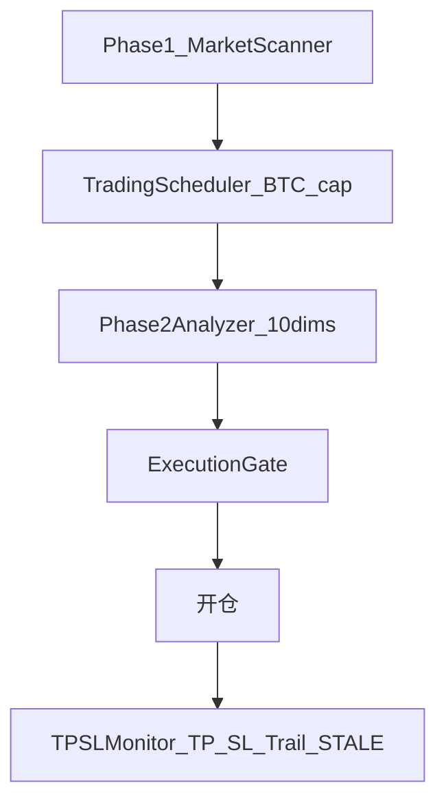

# 加密实盘优化计划

> **版本**: 1.0  
> **状态**: 执行中  
> **关联**: [auto-trading-plan.md](./auto-trading-plan.md)、[crypto-backtest-plan.md](./crypto-backtest-plan.md)、[CONFIG_PARAMS.md](./CONFIG_PARAMS.md)  
> **配置真源**: `extensions/config/config.json`

本文档是加密实盘（Top50 + Phase1/2 + Gate + TPSL）参数与流程优化的**唯一指挥台**。所有实验结果、灰度记录与变更日志均更新于此。

---

## 一、优化目标（KPI）

| 类型 | 指标 | 说明 |
|------|------|------|
| **主目标** | Sharpe | 风险调整后收益，扫参排序首选 |
| **主目标** | 期望值 | `total_return / trade_count`（回测或实盘） |
| **硬约束** | `max_drawdown` | 候选参数不得超基线回撤的 **110%** |
| **硬约束** | STALE 占比 | `reason=stale` 笔数 / 总平仓笔数，目标下降 |
| **次要** | 胜率、交易频率 | 分 **趋势市** / **横盘市** 子区间汇报 |

**禁止**：仅凭 108 少量实盘笔数调参；禁止未回测放大 `max_positions`。

---

## 二、108 实盘诊断基线（2026-05-22 ~ 2026-05-25）

数据来源：`43.156.100.108` → `~/.vibe-trading/trading.db` → `closed_trades`（11 笔）。

| 指标 | 数值 |
|------|------|
| 总已实现 PnL | +4.17 USDT |
| 胜率 | 63.6%（7 胜 / 3 负 / 1 平） |
| 平均盈利单 | +0.78 USDT |
| 平均亏损单 | -0.44 USDT |
| 持仓时长中位 | 6.0h（TP）；STALE 固定 24.0h |

**按平仓原因**

| reason | 笔数 | 中位持仓(h) |
|--------|------|-------------|
| TP | 6 | 6.0 |
| STALE | 3 | 24.0 |
| SL | 1 | 5.5 |
| RECONCILE_GONE | 1 | 0.1 |

**品种集中度风险（⚠️）**：HYPEUSDT 两笔合计 +3.98 USDT（约占总盈利 95%）。剔除 HYPE 后期望值为负，11 笔统计功效极低，§六 Phase A 需扩大样本量后再下结论。

**近期行为（2026-05-25）**

- 最后一笔开仓：03:20 INJUSDT LONG（score=5）
- 04:24 后：`Rankings=0` 为主（Phase1 最高 watchlist score≈4）
- 05:59：曾 1 个 SHORT score≥6，被 BTC 1h STRENGTH 拦截（仅 console，未写 file log）
- 07:03 / 10:00：部署重启，非长期宕机

---

## 三、优化原则

1. **回测同源**：[`CryptoLiveBacktestEngine`](../extensions/trading/crypto/backtest/engine.py) 复用 `MarketScanner` / Gate / TPSL / STALE 逻辑。
2. **单变量灰度**：108 每次只改 `config.json` 一项，观察 ≥2 周。
3. **行情分档**：全周期最优须在横盘、趋势两段子区间复检。
4. **Fork 规则**：逻辑仅改 `extensions/`；不改 `agent/`（除 `ext_bridge.py`）。

---

## 四、系统边界



**Phase2 维度 → 上游技能**（[`phase2.py`](../extensions/trading/crypto/live/phase2.py)）

| dim | 技能 |
|-----|------|
| dim1 | technical-basic, candlestick |
| dim2 | onchain-analysis, stablecoin-flow |
| dim3 | perp-funding-basis, liquidation-heatmap |
| dim4 | sentiment-analysis, social-media-intelligence |
| dim5 | volatility |
| dim6 | stablecoin-flow, market-microstructure |
| dim7 | risk-analysis |
| dim8 | correlation-analysis, sector-rotation |
| dim9 | global-macro, etf-analysis |
| dim10 | behavioral-finance, regulatory-knowledge |

| 档位 | score | Phase2 维度 |
|------|-------|-------------|
| fast_track | ≥7 | dim1,3,5,6,7 |
| enhanced | 5–6 | dim1–10 |
| watchlist | 3–4 | 无 Phase2 |

---

## 五、参数候选清单

| 优先级 | config.json 键 | 现值 | 候选 | optimize_crypto sweep |
|--------|----------------|------|------|------------------------|
| P0 | `trading.min_entry_score` | 5 | 5；横盘 profile 4+半仓 | `min_score` |
| P0 | `market_scanner.vol_ratio_high_score_threshold` | 1.5 | 1.2 | Phase B+（需引擎读配置） |
| P1 | `trading.reward_risk_ratio` | 2.0 | 1.5 / 2.0 | `reward_risk` |
| P1 | `tpsl_monitor.trailing_activation_pct` | 3.0 | 2.0–2.5 | `trail_activation` |
| P1 | `tpsl_monitor.stale_position_hours` | 24 | 16–20 | `stale_hours` |
| P1 | `tpsl_monitor.stale_position_pnl_pct` | 3.0 | 2.0–2.5 | `stale_pnl_pct` |
| P2 | `trading.max_positions` | 3 | 4 | `max_positions` |
| P2 | BTC 1h 门控 | 二元 STRENGTH/WEAKNESS | 低波动 NEUTRAL 带 | 代码 ADR |

---

## 六、分阶段执行计划

### 进度总表

| 阶段 | 状态 | 完成日 | 备注 |
|------|------|--------|------|
| 文档建立 | done | 2026-05-25 | v1.0 |
| A 基线回测 | done | 2026-05-25 | A3-syn-long 1636 笔，见 §7.1 |
| B 参数扫描 | in_progress | | 长周期重扫中，见 §7.2 |
| C Phase2 反事实 | blocked | | 无 replay JSONL，见 §7.3 |
| D 配置/可观测 | done | 2026-05-25 | stale_pnl 2.5 + watchlist 日志 |
| E 生产验证 | deployed | 2026-05-25 | 108 live-trading，见 §7.4 |

### Phase A — 回测基线

**目标**：确立对照组（synthetic + CCXT），基线交易笔数 ≥100。若 8 symbols 区间不足，增至 20–50 symbols 或延长区间至 2 年。

**命令**（项目根目录）：

```bash
cd /Users/uncless/workspace/python-code/Vibe-Trading

# 冒烟（无网络）
python extensions/ext_cli/run_crypto_backtest.py \
  --synthetic --top50 --max-symbols 20 \
  --start 2024-01-01 --end 2026-05-01 --scan-every 12

# 真实 K 线（需代理时加代理地址）
python extensions/ext_cli/run_crypto_backtest.py \
  --top50 --max-symbols 20 \
  --start 2025-11-01 --end 2026-05-01 \
  --scan-every 12 7897
```

**通过标准**：基线 ≥100 笔；§7.1 表至少 1 行 synthetic + 1 行 CCXT。

### Phase B — 参数扫描

**目标**：`optimize_crypto.py` 单变量 sweep，结果写入 `.cache_crypto/optimization_results.csv`。

**前提**：Phase A 基线 ≥100 笔；否则延长区间或增加 symbols。

**顺序**：`min_score` → `reward_risk` → `trail_activation` → `stale_hours` → `stale_pnl_pct` → `quick` grid → **Phase B+ 组合验证**

```bash
# 单变量 sweep（区间与 Phase A 一致）
python extensions/ext_cli/optimize_crypto.py --synthetic --top50 --max-symbols 20 \
  --start 2024-01-01 --end 2026-05-01 --sweep min_score

python extensions/ext_cli/optimize_crypto.py --synthetic --top50 --max-symbols 20 \
  --start 2024-01-01 --end 2026-05-01 --sweep reward_risk

python extensions/ext_cli/optimize_crypto.py --synthetic --top50 --max-symbols 20 \
  --start 2024-01-01 --end 2026-05-01 --sweep stale_hours

python extensions/ext_cli/optimize_crypto.py --synthetic --top50 --max-symbols 20 \
  --start 2024-01-01 --end 2026-05-01 --grid quick

# Phase B+：组合回测（验证交互效应）
python extensions/ext_cli/optimize_crypto.py --synthetic --top50 --max-symbols 20 \
  --start 2024-01-01 --end 2026-05-01 \
  --combo stale_pnl_pct reward_risk
```

**通过标准**：单变量 Sharpe 最高且回撤 ≤ 基线×1.1；组合回测验证推荐组合（§7.2）Sharpe ≥ 单变量最优的 90%。

### Phase C — Phase2 反事实

**目标**：评估 LLM/技能过滤是否提升期望值。

```bash
# 积累 replay（108 或本地）
python extensions/ext_cli/run_live_trading.py --mock --swarm-phase2-shadow

# 回测对比
python extensions/ext_cli/run_crypto_backtest.py --top50 --start 2025-11-01 --end 2026-05-01
python extensions/ext_cli/run_crypto_backtest.py --top50 --start 2025-11-01 --end 2026-05-01 --replay-phase2
python extensions/ext_cli/run_crypto_backtest.py --top50 --start 2025-11-01 --end 2026-05-01 --replay-swarm
```

**通过标准**：§7.3 有明确结论（保留 / strict / 减维）。

### Phase D — 配置分档与可观测性

- `config.json` 增加 `profiles.low_volatility` 或注释块（文档化）
- 可选：`run_live_trading.py` scan 后 log watchlist Top3
- 可选：BTC 1h NEUTRAL 带（见 §九 ADR）

**通过标准**：仅 **一项** 变更进入 Phase E。

### Phase E — 生产验证

回测验证通过后直接部署至 108 生产环境，不再设 2 周灰度期。

```bash
git checkout dev && git add extensions/config/config.json docs/ ...
git commit -m "feat[ext]: apply crypto optimization profile from backtest"
git push origin dev

ssh server1 "cd /root/vibe-trading && git fetch origin && git reset --hard origin/dev \
  && docker compose build --no-cache live-trading && docker compose up -d live-trading"
```

**通过标准**：部署后首周 STALE 占比与期望值不劣于 §二 基线；无熔断/对账异常。触发 §十一 回滚规则时立即回滚。

---

## 七、实验记录

### 7.1 基线回测（Phase A）

| run_id | 数据 | 区间 | symbols | scan_every | return | sharpe | max_dd | win_rate | trades | stale_pct | 日期 |
|--------|------|------|---------|------------|--------|--------|--------|----------|--------|-----------|------|
| A3-syn-long | synthetic | 2024-01-01~2026-05-01 | 20 | 12 | +300.0% | 2.09 | -17.3% | 54.9% | 1636 | 45.7% | 2026-05-25 |
| A1-syn | synthetic | 2024-01-01~2024-06-01 | 8 | 12 | +1.60% | 0.36 | -7.76% | 46.7% | 15 | 46.7% | 2026-05-25 |
| A2-syn | synthetic | 2025-11-01~2026-05-01 | 8 | 12 | +16.27% | 2.41 | -7.38% | 73.3% | 15 | 33.3% | 2026-05-25 |
| A2-ccxt | ccxt（首次拉数） | 2025-11-01~2026-05-01 | 8 | 12 | — | — | — | — | 15 | 60.0% | 2026-05-25 |

**说明**：**A3-syn-long** 为 Phase A 正式基线（`initial_cash=1000`，20 symbols，1636 笔）。A1/A2 为早期短窗口冒烟（`initial_cash=50` 导致 score 5–6 被 min_notional 拦截，仅 15 笔，**勿作扫参对照**）。本地 CCXT 后续因网络失败回退 synthetic；A2-ccxt 行 `stale_pct` 来自首次成功拉数。Phase B 扫参以 **A3** 为对照（max_dd 基线 -17.3%，110% 上限 -19.0%）。

⚠️ **数据源敏感性**：A2-ccxt stale_pct 60%  vs A2-syn 33.3%，同区间不同数据源 stale 率差近 2 倍。CCXT 数据含真实波动与缺口，synthetic 数据平滑度不同导致 STALE 触发频率差异。回测结论以 synthetic 为主，CCXT 仅作交叉验证。

### 7.2 参数扫描（Phase B）

⚠️ **样本量警告（已解决）**：A3 长基线 1636 笔。下方旧表（A1 对照 15 笔）**已作废**，长周期重扫结果写入 `optimization_results_long.csv`。

**Top 候选（长周期重扫，待回填）**：

| rank | min_score | rr | trail_act | stale_h | stale_pnl% | sharpe | max_dd | trades | 备注 |
|------|-----------|-----|-----------|---------|------------|--------|--------|--------|------|
| — | — | — | — | — | — | — | — | — | 扫参进行中 |

**旧结果（A1 对照 15 笔，已作废）**：
| 1 | 5 | 1.5 | 3.0 | 24 | 2.5 | 0.40 | -3.01% | 5 | 单扫 `reward_risk`；交易数少 |
| 2 | 5 | 2.0 | 3.0 | 24 | 2.5 | 0.36 | -6.24% | 14 | 单扫 `stale_pnl_pct`；收益最高 |
| 3 | 5 | 2.0 | 3.0 | 24 | 3.0 | 0.16 | -3.89% | 7 | 基线 A1-sharpe 附近 |

⚠️ **样本量警告**：A1 基线仅 15 笔，单扫后 trade_count 最低 5 笔。5 笔 Sharpe 0.40 的 95% CI 极宽，结论仅为方向性提示，非统计显著。Phase A 扩大样本后需重新 sweep。

**结论（A1 对照，max_dd 基线 -7.76%，110% 上限 -8.54%）**

- `min_score` 4–7 在本区间同结果，**勿降**。
- `reward_risk` 1.5–3.0 显著改善回撤（-3%），Sharpe 0.40；trade_count 降至 5（⚠️ 样本量不足）。
- `stale_pnl_pct` 2.5 提升收益（+11.45%）且 dd 合格；建议 Phase D 优先试此项。
- `quick` grid 全负 Sharpe，**勿**采用组合格结果；参数间存在交互效应。
- 推荐灰度组合（**必须经 Phase B+ 组合回测验证**）：`stale_pnl_pct=2.5` + 保持 `reward_risk_ratio=2.0`。

完整 CSV（长周期）：`extensions/ext_cli/.cache_crypto/optimization_results_long.csv`  
旧 CSV（短样本，作废）：`extensions/ext_cli/.cache_crypto/optimization_results.csv`

### 7.3 Phase2 反事实（Phase C）

| 模式 | return | sharpe | max_dd | trades | 结论 |
|------|--------|--------|--------|--------|------|
| 无 Phase2 | — | — | — | — | 默认回测路径 |
| replay-phase2 | — | — | — | — | **待数据** |
| replay-swarm | — | — | — | — | **待数据** |

**阻塞**：本地与 108 均无 `~/.vibe-trading/logs/phase2_replay_*.jsonl` 或 `swarm_shadow.jsonl`。

**下一步**：`python extensions/ext_cli/run_live_trading.py --mock --swarm-phase2-shadow` 运行 ≥2 周后执行 `--replay-phase2` / `--replay-swarm` 回测并回填上表。

### 7.4 生产验证（Phase E）

| 变更项 | 旧值 | 新值 | 开始日 | 2周PnL | STALE占比 | 备注 |
|--------|------|------|--------|--------|-----------|------|
| `tpsl_monitor.stale_position_pnl_pct` | 3.0 | **2.5** | **2026-05-25** | — | — | Phase B sweep 推荐；108 deploy 完成 |

**部署检查清单**（Phase E，手动执行）：

1. `git checkout dev` → commit `feat[ext]: stale pnl band 2.5% + watchlist log + optimization doc`
2. `git push origin dev`
3. 108：`git reset --hard origin/dev` → `docker compose build --no-cache live-trading && docker compose up -d live-trading`
4. 每日检查是否触发 §十一 回滚规则
5. 首周后更新本表与 §二 108 诊断

---

## 八、命令速查

| 用途 | 命令 |
|------|------|
| 单次回测 | `python extensions/ext_cli/run_crypto_backtest.py --top50 --max-symbols 20` |
| 扫参 | `python extensions/ext_cli/optimize_crypto.py --top50 --sweep <name>` |
| 实盘 mock | `python extensions/ext_cli/run_live_trading.py --mock` |
| 扩展测试 | `pytest extensions/tests/test_crypto_backtest/ -q --tb=short` |
| 108 日志 | `docker logs --tail=50 vibe-trading-live-trading-1` |

---

## 九、ADR（待决策）

### ADR-001：BTC 1h NEUTRAL 带

**问题**：`check_btc_1h_trend()` 在 EMA12≠EMA26 时恒为 STRENGTH/WEAKNESS，横盘（BTC 24h<2%）仍禁止山寨空单。

**候选**：仅当 `|EMA12-EMA26|/price > 0.15%` 且 `|BTC_24h%|>1.5%` 才启用逆势门控。

**状态**：proposed — Phase D 实现前需 Phase B 回测验证。

### ADR-002：低波动配置分档 `profiles.low_volatility`

| 字段 | 建议值 |
|------|--------|
| `min_entry_score` | 5（或 4 + `score_tier_half_size=4`） |
| `vol_ratio_high_score_threshold` | 1.2 |
| `reward_risk_ratio` | 1.5 |
| `stale_position_hours` | 18 |
| `stale_position_pnl_pct` | 2.5 |

**状态**：proposed — 依赖 Phase B+ 组合回测结果；若组合 Sharpe 低于单变量最优 90%，则废弃。

---

## 十、手续费与资金费率

回测引擎默认假设 taker 手续费 **0.05%**（Binance U 本位合约标准）。若实际 VIP 等级更低，需调整 `CryptoBacktestConfig.fee_rate`。

空头持仓需考虑资金费率成本。当前回测未建模资金费率，保守估计增加 **0.01%/8h** 成本（年化约 -10.95%）。空头期望收益需覆盖此成本。

---

## 十一、回滚规则（Phase E 生产验证）

生产验证期间若触发以下任一条件，**立即回滚 config** 到上一稳定版本：

| 条件 | 阈值 | 检查频率 |
|------|------|----------|
| 连续止损 | 连续 3 笔 SL | 每笔平仓后 |
| 回撤上限 | 7 天内 max_dd > -15% | 每日 |
| STALE 恶化 | STALE 占比 > 40%（连续 5 笔中 ≥2 笔 STALE） | 每笔平仓后 |
| 对账异常 | reconcile_positions() 发现持仓偏差 > 1% | 每次对账后 |
| 期望值骤降 | 最近 10 笔平均 PnL < -0.5 USDT | 每笔平仓后 |

**回滚命令**：

```bash
git revert HEAD  # 撤销灰度 commit
git push origin dev
# 108 重新 deploy
```

---

## 十二、变更日志

| 日期 | 类型 | 说明 | commit |
|------|------|------|--------|
| 2026-05-25 | docs | 初版优化计划 v1.0 | |
| 2026-05-25 | docs+ext | Phase A/B 结果；stale_pnl 2.5；watchlist 日志；optimize_crypto sweep 扩展 | |
| 2026-05-25 | ext | 回测 initial_cash=1000；A3 长基线 1636 笔；Phase B 长周期重扫启动 | |

